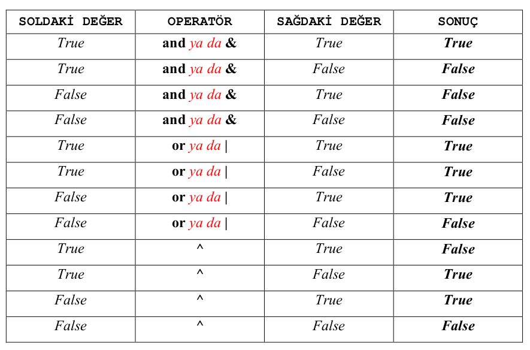
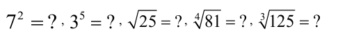
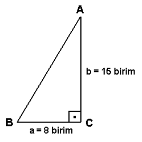
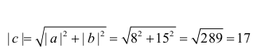
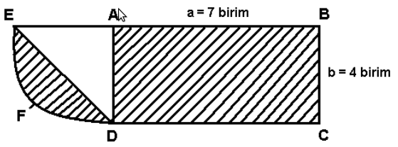

## LABORATUVAR ÇALIŞMASI 2 - Değişkenler, Veri Girişi, Çevre & Alan Hesapları 

### Bu Çalışmanın Amacı

Bu çalışmadaki amacımız; değişken tanımlama, operatörler, veri girişi, çevre & alan hesapları ve 'doctest' kullanımı konularında öğrendiklerimizi pekiştirmektir.

### Değişken Tanımlama

"**Değişken**" i, bir niceliğin depolanabileceği bir yer, alan olarak tanımlayabiliriz. Değişkenler, içlerinde bir **karakter dizisi** (örneğin isminiz) bulundurabiliceği gibi bir **tamsayı** (örneğin yaşınız) ya da **ondalıklı sayı** da
(örneğin boyunuz) bulundurabilirler. Değişkenlerin türleri de içlerinde bulundurdukları bu değerlere göre değişmektedir. Örneğin, Python yorumlayıcısını etkileşimli biçimde kullanarak, ismi "Emre", yaşı 23 ve boyu 1.83 olan bir kişinin bu bilgilerini saklamak üzere üç ayrı değişken tanımlayalım:

~~~~{.python}
>>> isim = "Emre"
>>> yas = 23
>>> boy = 1.83
~~~~

Şimdi bu değişkenlerin her birinde ilgili kişiye ait bazı değerler tutulmakta olup bunlardan birisi karakter dizisi şeklinde olan isim ("**isim**" değişkeni içerisinde), diğeri tamsayı şeklinde olan yaş ("**yas**" değişkeni içerisinde), bir diğeri ise ondalıklı sayı şeklinde olan boy ("**boy**" değişkeni içerisinde) bilgilerdir.

Matematikte kullandığımız karmaşık sayıları da Python' da tanımlayabiliriz. "5 + 12j" ve "0 - 3j" sayılarının tanımlanmasına ait örnek, aşağıdadır:

~~~~{.python}
>>> a = 5 + 12j
>>> b = -3j
~~~~

Python' da bir değişkenin, ya da bir değişkene atanabilecek bir değerin türünü öğrenmek için "**type()**" fonksiyonu kullanılır. Türü öğrenilmek istenen değişken ya da değer, bu fonksiyonun parantezleri içerisine yazılır.

Yukarıda vermiş olduğumuz tanımlama örnekleri üzerinden (Python Shell penceresini kapatmadan) devam edecek olursak, "**type()**" fonksiyonunun kullanımı ile ilgili şu örneği verebiliriz:

~~~~{.python}
>>> type(isim)
<type 'str'>
>>> type(yas)
<type 'int'>
>>> type(boy)
<type 'float'>
>>> type(a)
<type 'complex'>
~~~~

Örnekte görüldüğü gibi "**type()**" fonksiyonu bize değişkenlerin türlerini vermektedir. Burada **str** "karakter dizisi" ne, **int** "tamsayı" ya, **float** "ondalıklı sayı" ya, **complex** ise "karmaşık sayı" ya karşılık gelmektedir.

**type()** fonksiyonu ile değişkenlerin türlerini öğrenebileceğimiz gibi, **bu değişkenler içerisine atılacak olan değerlerin türlerini** de öğrenmemiz mümkündür. Python Shell ekranını kapatmadan yukarıdaki örneğe devam ederek bunu görebiliriz.

~~~~{.python}
>>> type("Alper")
<type 'str'>
>>> type(12)
<type 'int'>
>>> type(1.58)
<type 'float'>
>>> type(-6 - 7j)
<type 'complex'>
~~~~

Bütün bunları göz önünde bulundurursak "Python, pek çok programlama dilinden farklı olarak, **değişkenlerin türlerini, kendilerine atanan değerin türüne bakarak, atama işlemi sırasında ___dinamik olarak___ belirler.** diyebiliriz.

İçerisinde değer bulunan değişkenleri ise programda yer alan başka fonksiyonlarla / komutlarla birlikte kullanabiliriz. Örnek :

~~~~{.python}
>>> universite = "Ondokuz Mayıs Üniversitesi"
>>> il_trafik_kodu = 55
>>> print universite
Ondokuz Mayıs Üniversitesi
>>> print il_trafik_kodu
55
~~~~

### Operatörler 

Python' da, "**bool**" ismi verilen bir değişken türü vardır. **bool** türündeki bir değişkenin türü ya "**True** (doğru)", ya da "**False** (yanlış)" olabilir. Yanındaki kriter sağlandığında (değeri **True** olduğunda) kendi kapsamındaki kod parçalarının çalıştırılmasına müsaade ederken kriter sağlanmadığında (değeri **False** olduğunda) buna müsaade etmeyen if ve while yapılarında (İlerleyen konularda ele alınacaktır.) **bool** türündeki ifadeler sıklıkla kullanılırlar.

Bu operatörler (+, -, *, /, % gibi) sonuç olarak **sayı** ya da **karakter dizisi** döndürürken bazıları da (==, !=, <, >, <=, >= gibi) **bool** tipinde değerler döndürürler.

"**and**", "**or**" ve "**xor**" mantıksal operatörleri ise "True" ya da "False" olan ifadelerin arasında bulunarak **bağlaç** görevi görürler. Bu operatörlerden **and** ile **or** yazı ile yazılabildiği gibi, **and** operatörünü "**&**" işareti ile, **or** operatörü de "|" işaretleri ile göstermek de mümkündür. **xor** operatör ise sadece "^" işareti ile kullanılabilir. Bu bağlaçların döndürecekleri sonuç aşağıdaki tablodan yararlanılarak çıkarılabilir:

"**not**" operatörü ise kendisinden sonra gelen ifadenin doğruluk değerini değiştirerek **True** ise **False**, **False** ise **True** yapar:

~~~~{.python}
>>> 7 == 7
True
>>> not 7 == 7
~~~~

Diğer operatörlerin görevlerini hatırlayalım:

"+"  -> İki sayıyı ya da iki karakter dizisini birleştirir. Bir fonksiyon gibi işlemin sonucunu döndürür.

~~~~{.python}
>>> 3 + 9.0
12.0
>>> 'pyt' + 'hon'
'python'
~~~~

"-"	-> İki sayının farkını alır. Bir fonksiyon gibi işlemin sonucunu döndürür.

~~~~{.python}
>>> 8.74 - 19
-10.26
~~~~

"*"  -> İki sayıyı çarpar ya da bir karakter dizisini belirli bir sayıda tekrarlayarak arka arkaya ekler. Bir fonksiyon gibi işlemin sonucunu döndürür.

~~~~{.pyhton}
>>> 13 * 61
793
>>> 'ekim' * 4 
'ekimekimekimekim'
~~~~

"/" -> İki sayıyı böler ve **bölümü** hesaplar.Bölen ve bölünen tamsayı ise kalan ihmal edilir. Bölen ve bölünenden en az biri ondalıklı sayı ise bölme işlemi kalan üzerinden de devam eder ve ondalıklı bölme yapılır. Bir fonksiyon gibi işlemin sonucunu döndürür.

~~~~{.pyhton}
>>> 7 / 4
1
>>> 7 / 4.0 
1.75
~~~~

"%" -> İki sayıyı böler ve **kalan**ı hesaplar (Başka bir deyişe bir sayının diğerine göre **mod**unu hesaplar.) Bir fonksiyon gibi sonucunu döndürür.

~~~~{.python}
>>> 7 % 4 
3
>>> 7 % 4.0
3.0
~~~~

"==" -> iki ifadenin **eşitliğini** kontrol ederek **True** ya da **False** döndürür.

~~~~{.python}
>>> 8 == 9
False
>>> 7 == 'yedi'
False
>>> '19mayis' == '19mayis'
True
>>> 35 == 35.0
True
>>> 'apostrof' == "apostrof"
True
~~~~

"!=" -> İki ifadenin **farklılığını** kontrol ederek **True** ya da **False** döndürür.

~~~~{.python}
>>> 8 != 9
True
>>> 7 != 'yedi'
True
>>> '19mayis' != '19mayis'
False
>>> 35 != 35.0
False
>>> 'apostrof' != "apostrof"
False 
~~~~

"<" -> Soldaki ifadenin sağdakinden **küçüklüğünü** kontrol ederek **True** ya da **False** döndürür.

~~~~{.python}
>>> 8 < 9
True
>>> 4.41 < 4.40
False
>>> 'aa' < 'a'
False
>>> 'aa' < 'aaa'
True
>>> 'ab' < 'aa'
False
>>> 'ab' < 'ac'
True
~~~~

">" -> Soldaki ifadenin sağdakinden **büyüklüğünü** kontrol ederek **True** ya da **False** döndürür.

"<=" -> Soldaki ifadenin sağdakinden **küçük ya da** sağdakine **eşit olma durumunu** kontrol ederek **True** ya da **False** döndürür.

">=" -> Soldaki ifadenin sağdakinden **büyük ya da** sağdakine **eşit olma durumunu** kontrol ederek **True** ya da **False** döndürür.

### Veri Girişi

Python' da bir değişkene değer atıp, daha sonra bu değişkeni, içerisine atılan değer yerine kullanmayı incelemiştik. Yani " **universite** = "Ondokuz Mayıs Üniversitesi" " atamasını yaptıktan sonra "Ondokuz Mayıs Üniversitesi" değeri yerine "**universite**" değişkenini kullanmamız bizi aynı sonuca götürüyordu.

Bu kısımda ise programın, çalışma esnasında kullanıcıdan bir veri alarak, aldığı bu veriyi işleme tabi tuttuktan sonra kullanıcıya geri dönüş yapmasını inceleyeceğiz.

Python' da klavyeden veri almak için "raw_input()" fonksiyonu kullanılır. Bu fonksiyonda parantezler arasına, kullanıcıdan veri isterken ona hitaben ne söyleyeceğimizi (örneğin "Lütfen isminizi giriniz : "), karakter dizisi olarak gireriz. Bu fonksiyon çalıştırıldığında kullanıcıya bu karakter dizisini sunarak ondan ilgili değerleri girmesini ve ENTER tuşuna basması bekler. Değerler girilip tuşa basıldıktan sonra fonksiyon, girilen bu değeri döndürür (Fonksiyonun sol tarafında "=" işareti, onun da solunda bir değişken varsa fonksiyonun döndürdüğü değer, yani kullanıcının girdiği değer, bu değişkene atılır.).

Aşağıdaki örnekte betik dosyası kullanarak kullanıcıdan isim bilgisinin alınmasını ve kullanıcıya "Merhaba [kullanıcı ismi], hoş geldin." mesajının sunulmasını içeren gösterim yer almaktadır. Betik dosyasının içeriği şu şekildedir:

~~~~{.python}
isim = raw_input("Lütfen isminizi giriniz : ")
print "Merhaba", isim, ", hoşgeldin."
~~~~

Bu betik dosyası çalıştırıldığında, Python Shell ekranında, kullanıcıdan isim bilgisi istenecek
ve kullanıcı bilgi girişi yapıp "ENTER" tuşuna bastıktan sonra ekrana "Merhaba [kullanıcı ismi], hoşgeldin." mesajı yazdıracaktır. Betik dosyasının çalıştırılması ile ilgili örneği aşağıdaki kutuda bulabiliriz:

~~~~{.python}
Lütfen isminizi giriniz : Emre 
Merhaba Emre , hoş geldin.
~~~~

### Çevre ve Alan Hesapları

Python yorumlayıcısını hesap makinesi gibi kullanabileceğimizi ve değişken tanımlama işlemini daha önceki başlıklarda incelemiştik. Bu bölümde ise, öğrenmiş olduğunuz bu iki temel bilgiyi birleştirerek çevre ve alan hesabı gibi geometri problemlerinde kullanmayı öğreneceğiz.

Python' da toplama, çıkarma, çarpma ve bölme işlemleri sırasıyla "+", "-", "*" ve "/" işaretleri ile yapılır. Bunların yanında üs alma ve kök alma işlemleri de bizler için gerekli olacaktır. Python dilinde bir **a** sayısının **b.** dereceden kuvvetini hesaplamak için (**a** ve **b** sayılarının, aynı isimdeki değişkenlerin için bulunduğunu düşünürsek) "__a__* ** __b__" ifadesini kullanırız. aşağıdaki örnekte, birkaç üslü ve köklü ifadenin hesaplanması gösterilmiştir:

~~~~{.python}
>>> 7 ** 2
49
>>> 3 ** 5
243
>>> 25 ** (1 / 2)
1
>>> 25 ** (1.0 / 2.0)
5.0
>>> 25 ** 0.5
5.0
>>> 81 ** (1.0 /4.0)
3.o
>>> 81 ** 0.25
3.0
>>> 125 ** (1.0 / 3.0)
4.9999999999999991
>>> 125 ** 0.3
4.2566996126039225
>>> 125 ** 0.333
4.991959282691119
>>> round(125 ** (1.0 / 3.0)
5.0
~~~~

Örnekte verilen "7' nin 2. kuvveti" ve "3' ün 5. kuvveti" değerlerini bulmak için  bir önceki paragrafta yer alan "**a** * ** **b**" şeklindeki kullanım yeterli olmaktadır. Bir sayının **n.** dereceden kökünü almak ise **(1 / n).** dereceden üssünü almakla aynı olup; bu durum bize "**a** * ** **b**" şeklinde kullanım ile sadece üs değil, kök de alma imkanı vermektedir.

Ancak, kök alırken üsse, yani " ** " işaretlerinin sağ tarafında yazılan sayıya dikkat etmemiz gerekir. Örneğin, **25** sayısının karekökünü almak için "**25** * ** **(1 / 2)**" yazarsak, sonucun **5** olmasını beklememize rağmen **1** olduğunu görürüz. Bunun nedeni, üs olan "**1 / 2**" de yer alna **1** ve **2** sayılarının birer **tamsayı** olması, Python yorumlayıcısının ise **1**' i **2**' ye bölerken **ondalıklı bölme yerine tam sayı bölmesi yaparak** "**1' in içerisinde 2, sıfır kere vardır.**" sonucuna ulaşması ve neticede **25 sayısının 0. kuvvetini** döndürmesidir. Python' un ondalıklı bölme yapmasını sağlamak içinse 'üs' teki sayılardan **en az birisini** ondalıklı olarak girmemiz gerekmektedir. ("**1 / 2.0**" gibi). Bunu yaptığımızda bölme işleminin sonucunu direkt olarak yazmamız da bizi doğru sonuca ulaştıracaktır (**"25 ** 0.5"** gibi). Benzer durum, **81** sayısının **4.** dereceden kökünü alırken de geçerli olacaktır.

**125** sayısının **3.** dereceden kökünü alma işlemini incelediğimizde, **125**'in üssünde yer alması gerekn **"1.0 / 3.0"** sayısının **0.333333....** şeklinde sonsuza kadar devam ettiğini görürüz. Oysa ki **125** sayısının küp kökü **5**' tir. Örnekte de görüldüğü üzere, 'üs' te "**0.**" dan sonra ne kadar çok **3** koyarsak bölme işleminin sonucunu o kadar daha sağlıklı (gerçeğe yakın) hesaplamış olacağımız için küp kök işleminin sonucu da olması gereken **5** değerine o kadar çok yaklaşacaktır (Ancak ulaşamayacaktır.). Buna bir çözüm olarak, böylesi küsüratlı sayıları en yakın tamsayıya yuvarlamakta kullanılan "**round()**" fonksiyonundan yararlanarak, sonucunu yuvarlamak istediğimiz ifadeyi bu fonksiyonun parantezleri içine yazabiliriz. Örnekte de görüldüğü gibi bu fonksiyon aracılığı ile **125** sayısının küp kökü **5.0** olarak bulunmuştur.

Matematiksel işlemlerde iki farklı türden veriyi tek bir işleme soktuğumuzda, **daha özel* türden veri, **daha genel** bir türe çevirilir. Örneğin bütün dikdörtgenler birer kare olmamasına rağmen, bütün kareler birer dikdörtgendir. Kareler, dikdörtgenlerin özel bir türü olup, kenar uzunlukları birbirine eşittir. Benzer şekilde tamsayılar da ondalıklı sayıların **ondalıklı kısmı "0" olan** birer özel türüdür. Buna göre, bir tamsayı ile bir ondalıklı sayıyı aynı matematiksel işleme soktuğumuzda sonuç bir ondalıklı sayı olacaktır:

~~~~{.pyhton}
>>> 3 + 7.5
10.5
>>> 8 - 4.0
4.0
>>> 3 * 1.5
4.5
>>> 16.0 / 4
4.0
~~~~

Sıradaki örneğimizde, birbirine dik olan **a** ve **b** kenarlarının uzunlukları verilmiş bir ABC üçgeninin çevresinin hesaplanması üzerinde duracağız.

Problemin çözümünde, bir dik üçgende birbirine dik olan kenarların uzunluklarının kareleri toplamının karekökünün, dik açının karşısındaki kenarın uzunluğuna eşit olduğu bilgisinden faydalanabiliriz. Dik açının karşısındaki kenara "**c**" dersen **c**' nin uzunluğu:

birim olarak bulunur. Üçgenin çevre uzunluğu ise 
**Ç = |a| + |b| + |c| = 8 + 15 + 17 = 40** birim olarak bulunur. Python' u etkileşimli biçimde kullanarak bu problemi, aşağıdaki şekilde çözebiliriz :

~~~~{.python}
>>> a = 8
>>> b = 15
>>> c = (a ** 2 + b ** 2) ** 0.5
>>> cevre = a + b + c
>>> print "Üçgenin çevre uzunluğu", cevre, "birimdir."
Üçgenin çevre uzunluğu 40.0 birimdir.
~~~~

Burada dikkat etmemiz gereken şey, kenar uzunluklarını değişkenlerde tutup bu değişkenler üzerinde işlemler yaparak problem çözmenin, sadece sayılar üzerinde işlem yaparak ("**cevre = 8 + 15 + (8 ** **2 + 15** ** **2)** ** **0.5**" gibi) sonuca varmaya kıyasla çok daha anlaşılır ve basit olduğudur.

### Ek Bilgiler

* Python' da bir tamsayı ile bir karakter dizisi toplanamaz:

~~~~{.python}
>>> d = 2 + 'yedi'
***Hata Mesajı***
~~~~

* **print** komutu kullanılarak birden fazla karakter dizisi yazdırılmak istendiğinde bu karakter dizisinin arasına "**,**" konursa bu iki karakter dizisi aynı satıra ayrı ayrı yazılacaktır. Aralarına "+" konursa da aynı satıra ve bitişik yazılacaklardır:

~~~{.python}
>>> print 'Büyük', 'Taarruz'
Büyük Taarruz
>>> print 'Baş' + 'kumandanlık'
Başkumandanlık
>>> print 'Gazi', 'Mustafa', 'Kemal', 'ATATÜRK'
Gazi Mustafa Kemal ATATÜRK
~~~~

* "*" operatörünün sağına ve soluna birer pozitif tamsayı ve karakter dizisi koymak (Yerleri önemli değildir.), aslında karakter dizisini tamsayı adedince tekrarlamaktır:

~~~~{.pyhton}
>>> 'usul' * 2
'usulusul'
>>> 3 * 'NurAy'
'NurAyNurAyNurAy'
~~~~

* "Değişken Tanımlama" bölümünde incelemiş olduğumuz her bir değişken türünü karakter dizisine dönüştürerek temsili bir gösterim elde etmek için, "**repr()**" fonksiyonu kullanılır:

~~~~{.pyhton}
>>> repr('OMU')
"'OMU'"
>>> repr(60)
'60'
>>> repr(19.5)
'19.5'
>>> k = -9 + 4j
>>> k_repr = repr(k)
>>> print k_repr
(-9 + 4j)
~~~~

### Doctest Kullanımı

Python' da betik dosyasına bir fonksiyon yazdığımızda ("Fonksiyonlar" konusu ileride detaylı olarak ele alınacaktır.), bu fonksiyonun belirli değerler için doğru çıktılar üretip-üretmediğini kontrol etmek için bir **geçerli kılma** işlemine ihtiyaç duyabiliriz. Bu sayede, betik dosyasında yer alan komutların (kodların) F5 tuşuna basılarak yorumlanması sırasında, test edilecek olan fonksiyona çeşitli değerler verilir ve beklenen çıktıları üretip-üretmediği gözlenir. Eğer **bütün** test işlemleri başarı ile sonuçlanmışsa herhangi bir uyarı mesajı verilmez. Aksi durumda, hata ile karşılaşılan test işlemleri için **beklenen** ve **elde edilen** değerler (ki birbirlerinden farklı olacaklardır) belirtilerek uyarı mesajı verilir. Girilen tamsayının karesini döndüren "kare_al" fonksiyonuna ait örnek 'doctest' kullanımı aşağıdadır:

~~~~{.python}
def kare_al(sayi):
	"""
	Bu bir doctest ornegidir.
	>>> kare_al(2)
	4
	>>> kare_al(0)
	0
	>>> kare_al(-4)
	16
	"""
	return (sayi * sayi)
def _test():
	import doctest
	doctest.testmod()
if __name__ == "__main__":
	_test()
~~~~

Bu fonksiyon hatasız çalıştığı için F5' e basıldığında herhangi bir uyarı ile karşılaşılmadan kullanılabilecektir:

~~~~{.pyhton}
>>> kare_al(6)
36
~~~~

Üç tırnaklar arasına yazılmış üçüncü test örneğini değiştirelim:

~~~~{.python}
	>>> kare_al(-4)
	-16
~~~~

Betik dosyasını çalıştırdığımızda bir uyarı mesajı ile karşılaşacağız:

~~~~{.python}
**********************************************************************
File "__main__", line 8, in __main__.kare_al
Failed example:
	kare_al(-4)
Expected:
	-16
Got:
	16
**********************************************************************
1 items had failures:
	1 of 3 in __main__.kare_al
***Test Failed*** 1 failures.
>>> kare_al(6)
36
~~~~

Bu örnekte uyarı ile karşılaşmamızın nedeni "doctest" yapısındaki yapısındaki test örneklerinden birinin hatalı hazırlanmasıdır. "-4" sayısının karesi "16" olmalı iken test örneğinde "-16" olarak verilmiştir. Doctest örneklerinde bir değişiklik yapmadan fonksiyonu şu şekilde değiştirelim.

~~~~{.python}
def kare_al(sayi):
	"""
	Bu bir doctest ornegidir.
	>>> kare_al(2)
	4
	>>> kare_al(0)
	0
	>>> kare_al(-4)
	16
	"""
	return (2 * sayi)
def _test():
	import doctest
	doctest.testmod()
if __name__ == "__main__":
	_test()
~~~~

Burada, doctest örnekleri doğru iken fonksiyon hatalıdır. Bu durumda fonksiyon birinci ve ikinci örneklerini geçmeyi başarırken üçüncüsünü geçemeyecektir:

~~~~{.python}
**********************************************************************
File "__main__", line 8, in __main__.kare_al
Failed example:
	kare_al(-4)
Expected:
	-16
Got:
	-8
**********************************************************************
1 items had failures:
	1 of 3 in __main__.kare_al
***Test Failed*** 1 failures.
>>> kare_al(8)
16
~~~~

### Alıştırmalar

### Alıştırma - 1

**Görev**
Python yorumlayıcısını etkileşimli biçimde kullanarak, şu problemi çözünüz:

Eğer 10 kilometrelik bir yarışı 43 dakika 30 saniyede tamamladıysanız, 1 mil mesafeyi ortalama ne kadar sürede katetmiş olursunuz? (Not: 1 mil, 1.61 kilometreye karşılık gelmektedir.)

**İpucu**
Python yorumlayıcısını etkileşimli bir biçimde, bir hesap makinesi gibi kullanabilirsiniz. Python’ un matematiksel işlemler için kullandığı sözdizimi, standart matematiksel gösterimle hemen hemen aynıdır. Aşağıda iki farklı işlem ve bunlara ait sonuçlar yer almaktadır:

~~~~{.python}
>>> (8 + 4 / 2) + (6 - 2 * 2)
12
>>> ((8 + 4) / 2) + ((6 - 2) * 2)
14
~~~~

**Sonuç**
Bu problemi çözmek için kullanmış olduğunuz ifadeyi ve açıklamasını, varsa karşılaştığınız problemleri yazınız.

### Alıştırma - 2

**Görev**
Python yorumlayıcısını etkileşimli biçimde kullanarak aşağıda verilen ifadeler arasındaki farklılıkları bulunuz.

~~~~{.python}
a = 6
b = 8.5
c = "6"
d = "8.5"
~~~~

**İpucu**
"Değişken Tanımlama** bölümünü inceleyiniz.

**Sonuç**
Gözleminizin sonucunu ve / veya karşılaştığınız problemleri yazınız.

### Alıştırma - 3 

**Görev** 
Aşağıdaki kutuda yer alan, Python yorumlayıcısı etkileşimli biçimde kullanılarak yazılmış ifadeleri inceleyiniz ve yorumlayınız.

~~~~{.pyhton}
>>> m = 8
>>> type(m)
<type 'int'>
>>> n = 12.7
>>> type(n)
<type 'float'>
>>> p = m + n
>>> type(p)
<type 'float'>
>>> print m
8
>>> print n
12.7
>>> print p
20.7
~~~~

**İpucu**
"Değişken Tanımlama" bölümünü inceleyiniz.

**Sonuç**
Yorumlarınızı yazınız.

### Alıştırma - 4

**Görev**
"**lab02_ozgecmis.py**" isminde bir betik dosyası oluşturarak içerisine kullanıcıdan isim, soy isim, doğum yeri, doğum yılı ve meslek unvanı  bilgilerini alıp ekrana **birinci satırda** "[doğum yılı] senesinde dünyaya gelen [kullanıcı ismi] [kullanıcı soy ismi],
[doğum yeri] doğumludur.", **ikinci satırda ise** "[kullanıcı soy ismi], [meslek unvanı] olarak görev yapmaktadır." yazdıracak olan Python kodunu yazınız.

Program çalıştığında kullanıcıya soracağı sorular, kullanıcının vereceği cevaplar ve programın ürettiği ekran çıktısı, aşağıdaki kutuda yer alan örnekteki gibi olmalıdır:

~~~~{.python}
Lütfen isminizi giriniz : Emre
Lütfen soy isminizi giriniz : Gürbüz
Lütfen doğum yerinizi giriniz : Zonguldak
Lütfen doğum yılınızı giriniz : 1986
Lütfen meslek unvanınızı giriniz : bilgisayar mühendisi
1986 senesinde dünyaya gelen Emre Gürbüz , Zonguldak doğumludur.
Gürbüz , bilgisayar mühendisi olarak görev yapmaktadır.
~~~~

**Sonuc**
Gerçekleştiriminizi ve / veya karşılaştığınız problemleri yazınız.

### Alıştırma - 5

**Görev**
Aşağıdaki şekilde ABCD bir dikdörtgen, |AB| = |CD|, |AD| = |BC|; ADE ikizkenar dik üçgen, |AD| = |AE|; DFE yayı ise merkezi A noktası olan bir çembere ait olan 90 o lik bir yay parçasıdır. ABCD dikdörtgeninin yatay kenarları 7 birim, dikey kenarları ise 4 birim uzunluğunda olduğuna göre, şekildeki taralı alanların toplamı kaç birim karedir (π = 3.14 alınız.) ?

Yukarıdaki problemi, Python yorumlayıcısını etkileşimli biçimde kullanarak "Çevre ve Alan Hesapları" başlığı altında verilen örnektekine benzer biçimde çözünüz.

**Sonuç**
Çözümünüz hakkındaki açıklamaları ve Python kodlarınızı yazınız.

