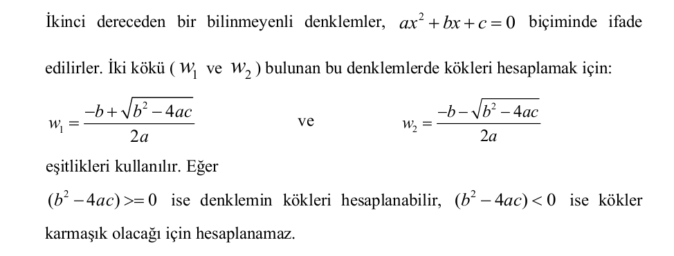

## LABROTUVAR ÇALIŞMASI 3 - Fonksiyonlara Giriş

### Bu Çalışmanın Amacı

Bu çalışmadaki amacımız; değer döndürmeyen fonksiyonlar, fonksiyon tanımlamaları ve arayüz kullanımı konuları hakkında öğrendiklerimizi pekiştirmektir.

### Fonksiyonlar

Bir programlama terimi olarak fonksiyon, "bir işlemi yerine getirmek üzere bir araya getirilmiş komutlar dizisi" olarak tanımlanabilir.

Programlamada fonksiyonlar kullanılmadan önce tanımlanırlar. Tanımlama esnasında fonksiyonun ne şekilde çağrılacağı (argüman alıp - almayacağı), hangi işlemleri gerçekleştireceği ve bir sonuç üretip - üretmeyeceği belirlenir. Çağırma işlemi ise, fonksiyonun tanımlanmasına uygun olmalıdır. Fonksiyonların değer döndürüp - döndürmemeleri ilerleyen konularda ele alıncaktır.

Fonksiyon çağrısı, **fonksiyonun ismini** ve isminin sağ tarafında yer alan parantezlerin içerisine **fonksiyonun aldığı argümanları" sırasıyla yazarak yapılır (Eğer fonksiyon argüman almıyorsa parantezlerin içi boş bırakılır.). Bir betik dosyasında kayıtlı olan aşağıdaki örneği inceleyelim:

~~~~{.pyhton}
def kare_ciz_7()
	print '*******\n*******\n*******\n*******\n*******\n*******\n*******\'
~~~~

"**kare_ciz_7**" fonksiyonu herhangi bir argüman almadan kendi içerisinde tanımlanmış olan işlemi (ekrana "*" karakterlerinden oluşan ve kenar uzunluğu 7 birim olan bir kare çizdirme işlemi) yaparak aşağıdaki ekran çıktısını üretmektedir:

~~~~{.python}
>>> kare_ciz_7():
*******
*******
*******
*******
*******
*******
*******
~~~~

Görüldüğü gibi, argüman almayan bu fonksiyonu kullanmak için, fonksiyonun bulunduğu betik dosyası açıkken F5 tuşuna basarak Python Shell ekranına gelmek ve fonksiyonun adını yazdıktan sonra sonuna "()" karakterlerini ekleyerek "**ENTER**" tuşuna basmak gerekmektedir.

### Matematiksel Fonksiyonlar

Python' da matematiksel fonksiyonları içerisinde bulunduran "math" isminde bir modül (birbiriyle ilişkili fonksiyonların bir arada toplandığı dosya) yer almaktadır. Matematiksel fonksiyonları kullanmak içinse bu modülden yararlanmamız gerekir. Python' da bir modülü çağırarak içerdiği fonksiyonları kullanabilmek için "**import**" komutu kullanmaktadır.

Aşağıdaki örnekte, **math** modülünün ve içerdiği bazı fonksiyonların kullanımı ele alınmıştır:

~~~~{.python}
>>> import math
>>> math.pow(5, 3)
125.0
>>> math.sqrt(289)
17.0
>>> math.pi
3.1415926535897931
>>> derece = 30
>>> radyan = derece / 360.0 * 2 * math.pi
>>> radyan
0.52359877559829882
>>> math.sin(radyan)
0.49999999999999994
>>> math.sqrt(math.pow(11, 2) + math.pow(60, 2))
61.0
~~~~

Örneğin ilk satırında, geri kalan satırlarda yer alan fonksiyonları kullanabilmemiz için gerekli olan **math** modülü çağrılmıştır. Örnekte; üs almakta kullanılan pow fonksiyonu, karekök almakta kullanılan **sqrt** fonksiyonu, Pi sabitini veren **pi** değişleni (math modülü içerisinde yer alan ve bu modülü çağırarak ulaşabileceğimiz sabit bir sayı) ve de radyan cinsinden bir açının sinüs değerini hesaplamakta kullanılan **sin** fonksiyonu yer almaktadır (Diğer fonksiyonlar hakkında bilgi almak için Python Shell komut satırına “ help('math')” yazabiliriz. ). En sondaki iki satırda ise bu fonksiyonların iç içe kullanılabileceğine dair bir gösterim bulunmaktadır.

### Fonksiyon Tanımlama ve Kullanma

Python' da fonksiyon tanımlamak için "**def**" komutu kullanılır. Bir betik dosyası oluşturarak fonksiyon tanımlamak için (**import** komutunu kullanarak gerekli modülleri çağırdıktan sonra) ilk başta "**def**" yazıp bir karakter boşluk bırakarak fonksiyonumua vermek istediğimiz ismi yazarız ve ismin hemen sağına "**(**" işaretini koyarak fonksiyonun almasını istediğimiz parametreleri (aralarına virgül koyarak) yazıp "**)**" işaretini ve son olarak da "**:**" işaretini ekleriz. İlk satırı bu şekilde oluşturduktan sonra alt satırlara geçerek fonksiyonun ne
yapmasını istiyorsak bunları satır satır kodlarız. Anlatılanları somutlaştırmak için aşağıdaki **örnek betik dosyasını** inceleyebiliriz:

~~~~{.python}
def Ogrenci(isim, soyisim, numara, universite, program):
	print isim, soyisim, 'adlı', numara, 'numaralı öğrenci,', universite, program, 'programında eğitim görmektedir.'
~~~~

Bu betik dosyasını kaydedi **F5** tuşuna bastıktan sonra (ya da **Run -> Run Module** dedikten sonra) Python Shell ekranına yazacağımız komutlar ve ekran çıktısı için aşağıdaki örnek incelenebilir:

~~~~{.python}
>>> Ogrenci('Emre', 'Gürbüz', 9210148, 'OMÜ', 'Yüksek Lisans')
Emre Gürbüz adlı 9210148 numaralı öğrenci, OMÜ Yükses Lisans Programında eğitim görmektedir.
>>> Ogrenci('Emre', 'Gürbüz', '9210148', 'OMÜ', 'Yüksek Lisans')
Emre Gürbüz adlı 9210148 numaralı öğrenci, OMÜ Yükses Lisans Programında eğitim görmektedir.
~~~~

Fonksiyonun içerisinde yer alan **print** komutu, sayıları ve karakter dizilerini aynı biçimde
ekrana yazdırdığı için üçüncü parametreyi sayı olarak ya da karakter dizisi olarak vermemizin
bir farkı olmayacaktır.

### Arayüz Kullanımı

Python’ da birbiriyle ilişkisi olan birden çok fonksiyonu tek bir dosyada toplayarak, daha
sonra bu fonksiyonlardan bir ya da birden fazlasına bu dosya üzerinden ulaşmak mümkündür.
Böylesi bir kullanım, istediğimiz fonksiyona daha kolay ve hızlı bir biçimde ulaşmamızı
sağlayacak, daha anlaşılır ve planlı bir programlama yapmamıza katkı sağlayacaktır. Örnek olarak “sekil_ciz.py” isminde bir betik dosyamız olsun (aşağıdaki kutuda) ve içerisinde
**dik üçgen çizme**, **dikdörtgen çizme** ve **kare çizme** fonksiyonlarını bulundursun:

~~~~{.python}
def dikdortgen_ciz(en, boy):
	isaret = ''
	for i in range(0, en):
		isaret = isaret + '*'
	for j in range(0, boy):
		print isaret

def dik_ucgen_ciz(taban):
	isaret = ''
	for i in range(0, taban):
		isaret = isaret + '*'
		print isaret

def kare_ciz(kenar):
	dikdörtgen_ciz(kenar, kenar)
~~~~

**NOT :** Yukarıda yer alan "**for [değişken] in range([alt sınır], [üst sınır]):**" kalıbı, bir ya da birden çok işlemi "[üst sınır] - [alt sınır]" defa tekrarlamak için kullanılır. Bu komut, ilerleyen bölümlerde ayrıntılı olarak ele alınacaktır. Bu örnek için, yukarıda yer alan fonksiyonların; dikdörtgen, dik üçgen ve kare çizdirmekte kullanıldıklarını bilmemiz yeterli olacaktır.

Biz de bir betik dosyası oluşturarak **sadece dörtgen çizimi yapan ve diğer şekillerin çizimleriyle ilgilenmeyen** bir tasarım yapalım. "şekil_ciz.py" ile aynı dizinde oluşturacağımız yeni betik dosyasına "dortgen_ciz.py" ismini verelim ve "sekil_ciz.py" içerisinde yer alan ve **dörtgenlerle ilgili olan** fonksiyonları **tekrar yazmadan**, sadece çağırarak kullanalım. "sekil_ciz.py" dosyasındaki fonksiyonların prototiplarini (isimleri ve argümanları) öğrenmek için Python Shell ekranında **help('sekil ciz')** yazabiliriz. Eğer tırnak kullanmadan, help(sekil_ciz) yazarsak hata mesajı ile karşılaşırız. Bunun nedeni, **"help" komutunun, betik dosyalarındaki yardımları görüntülemek için betik dosyasının ismine (karakter dizisi olarak) gereksinim duymasıdır.** Aşağıdaki kullanım örneğinde **help(sekil_ciz)** yazıldığı zaman, içerisinde bir dosya ismi saklayan "sekil_ciz" isimli bir değişken bulunamadığı için hata ile karşılaşılmıştır.

~~~~{.python}
>>> help('sekil_ciz')
Help on module sekil_ciz:

NAME
	sekil_ciz

FILE
	C:\python25\sekil_ciz.py

FUNCTIONS
	dik_ucgen_ciz(taban)

	dikdortgen_ciz(en, boy)

	kare_ciz(kenar)

>>> help(sekil_ciz)
***Hata Mesajı***
~~~~

Bir modül (fonksiyonların yer aldığı betik dosyası) içerisinde yer alan fonksiyonlar için de
yardım metni yazılabilir. Bu durumda ise **help(fonksiyon_ismi)** şeklinde bir kullanım
gereklidir ve **fonksiyonun ismi tırnak içine alınmaz.** “sekil_ciz.py” dosyasındaki “kare_ciz”
isimli fonksiyona yardım ekleme işlemi şu şekilde yapılabilir:

~~~~{.python}
def kare_ciz(kenar):
	"""
	kenar tamsayi olmalidir.
	Ornek Kullanim:
	kare_ciz(4)
	"""
	dikdortgen_ciz(kenar, kenar)
~~~~

F5 ile Python Shell ekranına gelelim:

~~~~{.python}
>>> help(kare_ciz)
Help on function kare_ciz in module __main__:

kare_ciz(kenar)
	kenar tamsayi olmalıdır.
	Ornek kullanim:
	kare_ciz(4)

>>> help('kare_ciz')
***Hata Mesajı ('kare_ciz' isimli bir betik dosyası arar ama bulamayınce bu hatayı verir)***
~~~~

Burada ise **help()** fonksiyonuna girdi olarak fonksiyon ismi verilmiştir.

"FUNCTIONS" bölümünde, "sekil_ciz.py" dosyası içerisinde yer alan fonksiyonların protiplerini görmek mümkündür. "dikgörtgen_ciz.py" dosyasını oluştururken de "sekil_ciz.py"
içerisindeki fonksiyonları yeniden yazmak yerine sadece çağıracağımız için, bu fonksiyonların prototiplerini bilmemiz yeterli olacaktır.

"dortgen_ciz.py" betik dosyasının içeriği, aşağıdaki gibi olacaktır;

~~~~{.pyhton}
from sekil_ciz import dikdortgen_ciz, kare_ciz

def dortgen_ciz_dikdörtgen(dikd_en, dikd_boy):
	dikdortgen_ciz(dikd_en, dikd_boy)

def dortgen_ciz_kare(dikd_kenar):
	kare_ciz(dikd_kenar)
~~~~

Bu dosyayı açarak **F5** ile Python Shell ekranına geçtiğimizde gerçekleştirebileceğimiz örnek kullanım aşağıdadır:

~~~~
>>> dortgen_ciz_dikdortgen(6, 4)
*******
*******
*******
*******
>>> dortgen_ciz_kare(3)
***
***
***
~~~~

**NOT:** Bir betik dosyasındaki **tüm fonksiyonları** çağırmak için "*" kullanabiliriz:

~~~~{.python}
from sekil_ciz import *
~~~~

Tüm bu işlemleri değerlendirelim. Örneğin elimizde bir müzik seti var, biz de hangi tuşa basıldığında müzik CD' sini dinleyebileceğimizi, hangi düğmeyle radyoyu açabileceğimizi, hangi kontrolü kullanarak ses ayarı yapabileceğimizi biliyoruz. Ancak, bu düğmelere basıldığında müzik setinin içinde gerçekleşen fiziksel olayları bilmiyoruz ve ilgilenmek de istemiyoruz, çünkü bizim amacımız sadece müzik dinlemek ve sadece kontrollerin ne işe yaradığını bilmemiz bizim için yeterli. Müzik setinin üzerindeki düğmeler ve kontroller, bu aletin **ara yüzü**nü oluşturmaktadır.

İşte burada da, "sekil_ciz.py" dosyası içerisinde yer alan fonksiyonlarn **nasıl kullanıldığını** bilip, **arka planda neler yaptığını** bilmeye gerek duymadan, "dortgen_ciz.py" içerisinde çağırarak kullandık. "sekil_ciz.py" deki fonksiyonların **prototipleri**, aynı zamanda **ara yüzleri** olarak da düşünülebilir. Bu fonksiyonları çağırabilmek için, "dikdortgen_ciz.py" betik dosyasının ilk satırında yer alan "**from ... import ...**" komutunu yazmak zorunda olduğumuzu da unutmamalıyız.

**NOT:** "dortgen_ciz.py" içerisindeki fonksiyonların isimleri ve parametreleri, "sekil_ciz.py" içerisindeki fonksiyonların isimleri ve parametreleri ile karıştırılmaması için farklı yazılmıştır.

### Alıştırma - 1

**Görev** 

**lab03_daire.py" isminde bir betik dosyası oluşturunuz ve bunun içerisinde, **math** modülündeki fonksiyonlardan yararlanarak, yarıçapı verilen bir dairenin çevre uzunluğunu ve alanını hesaplayıp bunları ekrana yazdıran "daire_fonk" isminde bir fonksiyon hazırlayınız. Fonksiyon argüman olarak yarıçap uzunluğunu almalı, herhangi bir değer döndürmemelidir. Çevre uzunluğu ve alan değerlerini hesapladıktan sonra bunları **anlaşılır bir biçimde** ekrana yazmalıdır (π sayısını **math** modülünden  elde ediniz.). Bu fonksiyon Pythhon Shell komut satırında çalıştırıldığında ekranda görülmesi beklenen sonuç aşağıdaki gibi olmalıdır:

~~~~{.python}
>>> daire_fonk(10)
Dairenin çevresi 62.8318530718 birimdir.
Dairenin alanı 314.159265359 birim karedir.
~~~~

**İpucu**

"Matematiksel Fonksiyonlar" ve "Fonksiyon Tanımlama ve Kullanma" bölümlerini inceleyiniz. Betik dosyasının en başında (fonksiyon tanımlamadan hemen önce ihtiyaç duyacağımız modülü/modülleri çağırmayı unutmayınız.

**Sonuç**

Gerçekleştirimizi ve/veya karşılaştırdığınız problemleri raporuuza yazınız.

### Alıştırma - 3

**Görev**
 

**NOT:** Fonksiyonunuza sadece kökleri hesaplanabilir denklemler verilecektir.

~~~~{.python}
>>> kok_hesapla(1, -1, -6)
Denklemin birinci kökü : 3.0
Denklemin ikinci kökü  : -2.0
>>> kok_hesapla(1, -2, 1)
Denklemin birinci kökü : 1.0
Denklemin ikinci kökü  : 1.0
~~~~

**İpucu** 

"Matematiksel Fonksiyonlar" ve "Fonksiyon Tanımlama ve Kullanma" bölümlerini inceleyiniz. Betik dosyasının en başında (fonksiyon tanımlamadan hemen önce) ihtiyaç duyacağınız modülü/modülleri çağırmayı unutmayınız.

**Sonuç** 

Gerçekleştiriminizi vey/veya karşılaştığınız problemleri raporunuza yazınız.

### Alıştırma - 3

**Görev**

"**math**" modülünde yer alan "**exp**", "**pow**" ve "**sqrt**" fonksiyonlarının **prototiplerinden yararlanarak**, üssel fonksiyonların yer aldığı "**lab03_ussel_fonk.py**" isimli bir betik dosyası oluşturunuz.

Bu dosya **F5** ile çalıştırıldığında örnek kullanım aşağıdaki gibi olmalıdır :

~~~~{.python}
>>> e_ussu(3)
20.0855369232
>>> us_hesapla(7, 2)
49.0
>>> karekok_al(169)
13.0
~~~~

**Not:** Fonksiyonunuz değer **döndürmemeli**, sonuçları ekrana yazmalıdır.

**İpucu** 

"Ara Yüz Kullanımı" bölümünü inceleyiniz. Betik dosyasının en başında (fonksiyon tanımlamadan hemen önce) ihtiyaç duyacağınız modülü / modülleri çağırmayı unutmayınız.

**Sonuç**

Gerçekleştiriminizi ve / veya karşılaştığınız problemleri raporunuza yazınız.

### Alıştırma - 4 

**Görev** 

Python yorumlayıcısını etkileşimli biçimde kullanarak kullanıcıdan sözcük (karakter dizisi olarak), boşluk uzunlugu (tamsayı olarak) ve tekrar sayisi (tamsayı olarak) alıp, ekrana sözcüğü 'tekrar sayisi' defa yazdıran ve bu sözcükler arasına da 'boşluk uzunlugu' adedince boşluk yerleştiren bir fonksiyon hazırlayınız. Fonksiyonunuza "lab03_bosluk_birak_tekrarla" ismini veriniz. **Fonksiyonunuzu doctest kullanarak** test ediniz. Fonksiyonun kullanımına dair örnek ekran görüntüsü aşağıdadır:

~~~~{.python}
>>> def bosluk_bırak_tekrarla(sozcuk, bosluk_uzunlugu, tekrar_sayisi):
	...[yazacağınız kısım]...

>>> bosluk_birak_tekrarla('bilgisayar', 3, 4)
bilgisayar   bilgisayar   bilgisayar   bilgisayar
>>> bosluk_birak_tekrarla('bilgisayar', 1, 3)
bilgisayar bilgisayar bilgisayar
>>> bosluk_birak_tekrarla('bilgisayar', 0, 5)
bilgisayarbilgisayarbilgisayarbilgisayarbilgisayar
~~~~

**İpucu**

Bir önceki laboratuvar çalışmalasında ele alınmış olan "Operatörler" bölümünü inceleyiniz. 

**Sonuç** 

Gerçekleştiriminizi ve / veya karşılaştığınız problemleri raporunuza yazınız.

