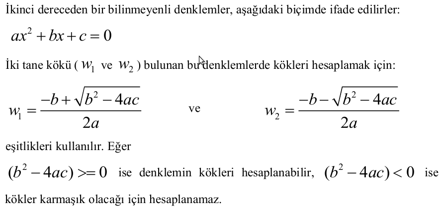
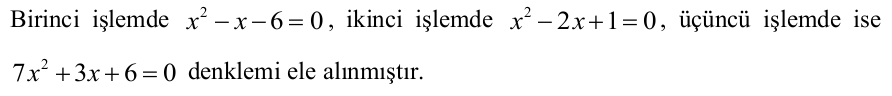
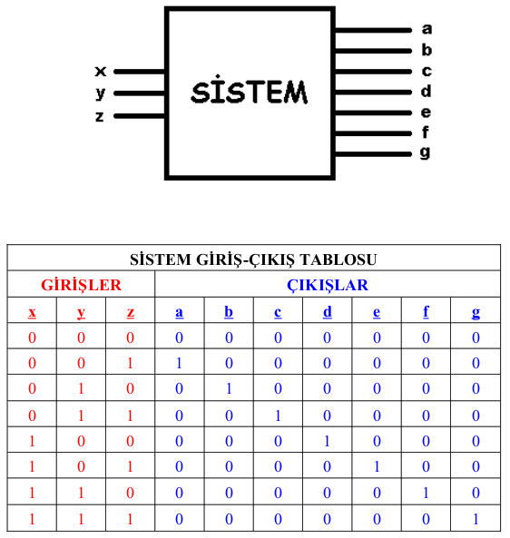
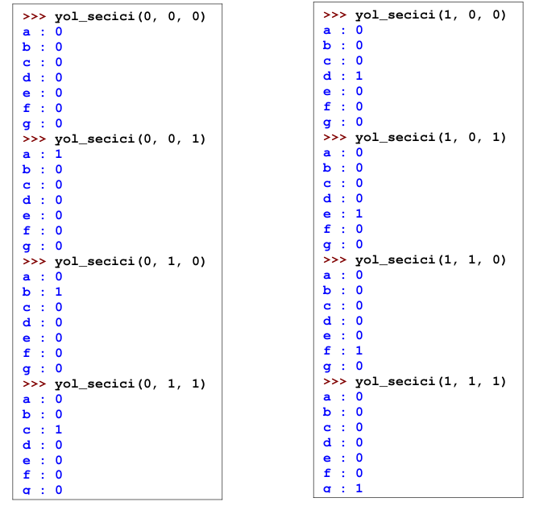
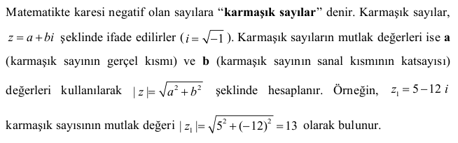
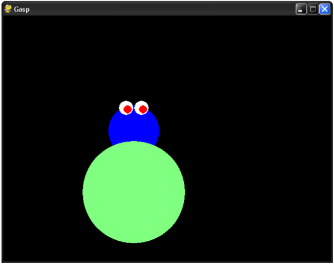
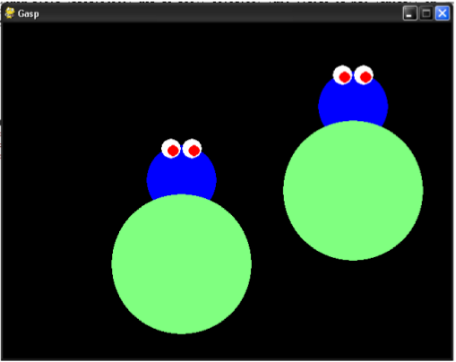
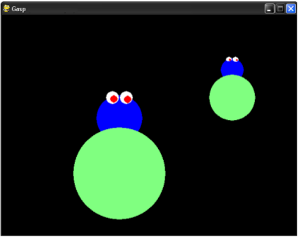
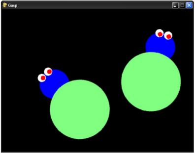

## LABORATUVAR ÇALIŞMASI 4 - Koşullu Yapılar 

### Bu Çalışmanın Amacı 

Bu çalışmadaki amacımız, koşullu yapılar ve girintili olarak kod yazma konularında öğrendiklerimizi pekiştirmektir.

**If yapısı**

Eğer Python' da program yazarken "Bu değişkenin değeri şöyle ise programımız şöyle yapsın, değilse de böyle yapsın." şeklinde bir şartlı yönlendirmeye ihtiyaç duyuyorsak, "**if**" yapısını kullanmamız gerekir. **if** komutu, sağında yer alan **kriter**in doğruluğunu kontrol eder, eğer doğru ise kendi kapsamına giren (Python' a göre kendisinin altında ve girinti olarak sağda yer alan) kod parçalarının çalıştırılmasına müsaade eder. Eğer kriter doğru değilse, programın akışını, kendi kapsamında olan kod parçalarının sona erdiği yerin ilerisine atlatır(Yani kendi kapsamındaki kodların çalışmasına müsaade etmez.). Eğer burada "else" ifadesi var ise bu, "**if**" kriteri sağlandıysa **else**' nin kapsamına giren kod parçaları es geçilecek, ama eğer **if** kriteri sağlanmadığı için program akışı **else**'nin olduğu satıra geldiyse **else**'nin kapsamında olan kod parçaları çalıştırıacak." anlamına gelmektedir. "**elif**" ifadesi ise **else**' nin **kritere sahip olanı**"dır. **else**' den farklı olarak **elif**' te bir de (tıpkı **if*' te olduğu gibi) sağ tarafta yer alan karşılaştırma kriterinin doğruluğu kontrol edilir ve doğruluk sağlanırsa **elif**' in kapsamında bulunan kod parçaları çalıştırılır.

**if** yapısındak kontrol edilebilecek kriterler, "**True**" ve "**False**" olan **boolean** değerlerdir (eşitlik, farklılık, büyüklük, küçüklük, büyük-eşitlik ve küçük-eşitlik gibi operatör bazlı karşılaştırmalardan elde edilen **boolean** değerler). Konuyu daha anlaşılır kılmak adına, betik dosyasında yer alan aşağıdaki fonksiyon örneğini inceleyerek yorumlamamız faydalı olacaktır:

~~~~{.python}
def yas_boy_kilo(yas, boy, kilo):
	boy_kusurat= 100.0 * float(boy) - 100.0
	fark = boy_kusurat - kilo 

	if yas > 30:
		if fark > 10.0:
			print ' Zayıfsınız, enerji veren yiyecekler tüketmeniz önerilir. '
		elif (10.0 >= fark) & (fark >= -10.0):
			print ' Kilonuz normal. '
		elif -10.0 > fark:
			print ' Kilolusunuz, spor yapmanız önerilir. '
	else:
		if fark > 10.0 :
			print ' Zayıfsınız, yorucu hareketlerden kaçınmanız önerilir. '		
		elif (10.0 >= fark) & (fark >= -10.0):
			print ' Yaşınıza rağmen formdasınız, tebrikler... '
		elif -10.0 > fark :
			print ' Kilolusunuz, diyet yapmanız önerilir. '
~~~~

**NOT:** 8. ve 15. satırlardaki "&" işareti "ve" bağlacı olup, sağındaki ve solundaki kriterlerin aynı anda sağlanmasını gerektirir (Sağlandığında **True**, diğer durumlarda **False** değerini üretir.). Yani eğer bu kriterlerden **en az biri** sağlanmıyorsa **elif** komutunun sağındaki tüm kriterler sağlanmamış sayılır. Fonksiyonu şöyle açıklayabiliriz :

Eğer **yas** 30'dan küçükse  **fark**'a bak. Eğer **fark** 10'dan büyükse ekrana "Zayıfsınız, enerji veren yiyecekler tüketmeniz önerilir." yaz, **fark** 10 ile -10 arasında ise ekrana "Kilonuz normal. yaz, fark -10' dan da küçükse ekrana "Kilolusunuz, spor yapmanız önerilir." yaz.

Eğer **yas** 30'dan küçük değilse (30 ise ya da 30' dan büyük ise) yine **fark**' a bak. Eğer **fark** 10'dan büyükse ekrana "Zayıfsınız, yorucu hareketlerden kaçınmanız önerilir." yaz, **fark** 10 ile -10 arasında ise ekrana "Yaşınıza rağmen formdasınız, tebrikler..." yaz, fark -10'dan da küçükse ekrana "Kilolusunuz, diyet yapmanız önerilir." yaz.

Bu fonksiyonu bit betik dosyasına kaydedip **F5** tuşuna basarak (ya da **Run -> Run Module** seçimini yaparak) Python Shell ekranına döndükten sonra çalıştırılmasını inceleyelim:

~~~~{.python}
>>> yas_boy_kilo(28, 1.70, 72)
Kilonuz normal.
>>> yas_boy_kilo(20, 1.80, 55)
Zayıfsınız, enerji veren yiyecekler tüketmeniz önerilir.
>>> yas_boy_kilo(18, 1.75, 120)
Kilolusunuz, spor yapmanız önerilir.
>>> yas_boy_kilo(75, 1.70, 52)
Zayıfsınız, yorucu hareketlerden kaçınmanız önerilir.
>>> yas_boy_kilo(48, 1.54, 51)
Yaşınıza rağmen formdasınız, tebrikler...
>>> yas_boy_kilo(63, 1.77, 108)
Kilolusunuz, diyet yapmanız önerilir.
~~~~

### Ardışık İşlemler

* Bir değişkene **birden çok kez** değer atandığında o değişkenin değeri, **en son atanan** değere eşittir.

~~~~{.python}
>>> saat = '19.25'
>>> print saat
19.25
>>> saat = '19.27'
19.27
~~~~

* Bir **b** değişkenine bir **a** değişkenini atadığımızda artık **b** değişkeninin değeri de **a**' nın değeriyle aynı olacaktır. Ancak daha sonra **a**' nın değerini değiştirirsek bu **b**' nin değerinde herhangi bir değişikliğe sebep **olmayacaktır**.

~~~~{.python}
>>> a = 8
>>> print a
8
>>> b = a
>>> print a
8
>>> print b
8
>>> a = -1
>>> print a 
-1
>>> print b
8
~~~~

* Eğer belli bir değere sahip bir değişkenin sağ tarafına "=" işareti koyup, onun da sağında **bu değişkenin de dahil olduğu** bir işlem yaparsak bu, "**Eşitliğin sağ tarafındaki işlemi yap, tamamla ve en sonunda bulduğun sonucu eşitliğin sol tarafındaki değişkeninin içerisine at.**" anlamına gelmektedir. Örnek:

~~~~{.python}
>>> x = 8
>>> print x
8
>>> x = x ** 2 + x / 2
>>> print x
68
~~~~

### Girintili Olarak Kod Yazma

Aşağıdaki I ve II numaralı betik dosyalarını ve bunlara ait kullanımı inceleyelim:

**I - Betik**

~~~~{.pyhton}
sayi = 5
if sayi > 10:
	print 'Sayı 10\' dan büyüktür.'
	print 'Sayının değeri: ', sayi
~~~~

**I - Çalıştırma**

~~~~{.pyhton}
>>>
~~~~

**II - Betik**

~~~~{.python}
sayi = 5 
if sayi > 10:
	print 'Sayı 10\' dan büyüktür.'
print 'Sayının değeri:', sayi
~~~~

**II - Çalıştırma**

~~~~{.python}
Sayının değeri: 5
~~~~

Pek çok programlama dilinden farklı olarak Python' da girintili olarak kod yazmanın özel bir anlamı vardır. Fonksiyon tanımlamalarında, "if", "while" gibi komutların kullanımında girinti olarak daha sağda yer alan kod parçaları, **kendisinin üzerinde yer alan ve girinti olarak daha solda yer alan komutun kapsamında** yer alıyormuşçasına değerlendirilirler.

I numaradaki her iki **print** komutu da **if** komutunun altında ve girinti olarak **daha sağda** yer aldıkları için, **if** komutunun kapsamında bulunmaktadırlar. I. örnekte, **if** komutundaki şart sağlanmadığı için I' deki **print** komutlarından ikisi de çalışmayacaktır. Ancak II. örnekte alttaki **print** komutu **if** komutu ile aynı hizada yer aldığı için onun kapsamına girmemektedir ve **if** komutundaki şartın sağlanıp-sağlanmamasından etkilenmeksizin sürekli olarak çalışacaktır.

Girintilerdeki boşluk sayısını programcının alışkanlıklarına göre belirlemesi mümkündür ancak hazırladığınız programlarda girinti için **4 boşluk** kullanmanız tavsiye edilir.

### Alıştırmalar

### Alıştırma - 1 

**Görev**

"**lab04_daire_fonk.py" isminde bir betik dosyası oluşturunuz. **math** modülündeki fonksiyonlardan yararlanarak, yarıçapı verilen bir dairenin çevre uzunluğunu ve alanını hesaplayarak bunları ekrana yazdıran bir fonksiyon hazırlayınız, fonksiyonunuza "daire_fonk" ismini veriniz ve Python Shell komut satırından bu fonksiyonu çalıştırınız. Fonksiyon argüman olarak yarıçap uzunluğunu almalı, herhangi bir değer döndürmemeli ve **yarıçap negatif girildiğinde ekrana "Yarıçap sıfırdan küçük olamaz." yazdırmalıdır. Çevre uzunluğu ve alan değerlerini hesapladıkran sonra bunları **anlaşılır bir biçimde** ekrana yazmalıdır. (π sayısını **math** modülünden  elde ediniz.). Bu fonksiyon Pythhon Shell komut satırında çalıştırıldığında ekranda görülmesi beklenen sonuç aşağıdaki gibi olmalıdır:

~~~~{.python}
>>> daire_fonk(10)
Dairenin çevresi 62.8318530718 birimdir.
Dairenin çevresi 314.159265359 birim karedir.
>>> daire_fonk(-7)
Yarıçap sıfırdan küçük olamaz.
~~~~

**İpucu**

"If Yapısı" bölümünü ve daha önceki çalışmalarda yer alan "Matematiksel Fonksiyonlar" ve "Fonksiyon Tanımlama ve Kullanma" bölümler bölümlerini inceleyiniz. Betik dosyanın en başında (fonksiyon tanımlamadan hemen önce) ihtiyaç duyacağınız modülü / modülleri çağırmayı unutmayınız.

**Sonuç**

Gerçekleştiriminizi ve / veya karşılaştığınız problemleri raporunuza yazınız.

### Alıştırma - 2

**Görev**

"**lab04_kok_hesapla.py**" isminde bir betik dosyası içerisinde, kullanıcıdan sırasıyla x^2 li terimin katsayısını, x'in katsayısını ve sabit terimi alarak denklemin köklerinin **hesaplanabilirliğini kontrol ettikten sonra eğer hesaplanabiliyorsa** hesaplayann ve bunları ekrana yazdıran bir fonksiyon hazırlayınız, fonksiyonunuza "**kok_hesapla**" ismini veriniz. Köklerin hesaplanamaması durumunda ise ekrana "Denklemin gerçel kökü bulunmamaktadır." bilgisinin yazdırılmasını sağlayınız.
Python Shell ekranında fonksiyonun çağrılması ve kullanımı, aşağıdaki örnekteki gibi olmalıdır:

~~~~{.python}
>>> kok_hesapla(1, -1, -6)
Denklemin birinci kökü : 3.0
Denklemin ikinci kökü  : -2.0
>>> kok_hesapla(1, -2, 1)
Denklemin birinci kökü : 1.0
Denklemin ikinci kökü  : 1.0
>>> kok_hesapla(7, 3, 6)
Denklemin gerçel kökü bulunmamaktadır.
~~~~

**İpucu**

"If Yapısı" bölümünü ve daha önceki çalışmalarda yer alan "Matematiksel Fonksiyonlar", "Fonksiyon Tanımlama ve Kullanma" bölümlerini inceleyiniz. Betik dosyasının en başında (fonksiyon tanımlamadan hemen önce) ihtiyaç duyacağınız modülü / modülleri çağırmayı unutmayınız.

**Sonuç**

Gerçekleştiriminizi ve / veya karşılaştığınız problemleri raporunuza yazınız.

### Alıştırma - 3

**Görev**

**x**, **y**, **z** girişleri; **a**, **b**, **c**, **d**, **e**, **f** ve **g** çıkışları olan bir sistem ve bu sisteme ait giriş-çıkışlara ait tablo aşağıda verilmiştir:

Betik dosyası kullanarak, kullanıcıdan **x**, **y**, **z** değerlerini **argüman** olarak alan ve çıkış değerlerini ekrana yazdıran "yol_secici" isimli bir fonksiyon yazınız ve betik dosyasına "lab04_yol_secici.py" ismini veriniz. *Mümkün olduğu kadar **az** satırda kodlama yaparak gerçekleştirimde bulunmanız gerekmektedir.* Gerçekleştirimini yapacağınız fonksiyon çalıştırıldığında elde edilecek ekran görüntüsü şu şekilde olmalıdır:

**İpucu**

Gerçekleştirimeniz beklenen fonksiyonun başlangıcı, aşağıdakine benzer olmalıdır:

~~~~{.python}
def yol_secici(x, y, z):
	if x == .....
.....
~~~~

"If Yapısı" bölümünü ve bir önceki laboratuvar çalışmamızda yer alan "Operatörler" bölümünü inceleyiniz.

**Sonuç**

Gerçekleştirminizi ve / veya karşılaştığınız problemleri raporunuza yazınız.

### Alıştırma - 4

**Görev**

Bu alıştırmada sizden, "**lab04_mutlak_genel.py**" isimli betik dosyasına "**mutlak_genel**" isminde, **argüman almayıp değer döndürmeyen** ve **gerek karmaşık sayıların, gerek tam sayıların, gerekse ondlıklı sayıların** mutlak değerini hesaplayan bir fonksiyon yazmanız beklenmektedir.

Fonksiyon, kullanıcıya "Karmaşık sayılar için 1, tamsayılar için 2, ondalıklı sayılar için 3, çıkmak için 4 giriniz" mesajını vermeli, kullanıcı **1** girerse karmaşık sayıların gerçel kısmını (**a**) ve sanal kısmının katsayısını (**b**) alarak sonucu ekrana yazmalı. **2** girerse tamsayıyı, **3** girerse de ondalıklı sayıyı isteyerek bunların mutlak değerini ekrana yazdırmalıdır. Örnek ekran görüntüsü aşağıdaki gibidir:

~~~~{.python}
>>> mutlak_genel()

Karmaşık sayılar için 1, tamsayılar için 2, ondalıklı sayılar için 3, çıkmak için 4 giriniz:
1
Gerçel kısmı giriniz		        	:3
Sanal kısmı (i' nin katsayısını) giriniz	:4

Komplex sayının mutlak değeri : 5.0

Karmaşık sayılar için 1, tamsayılar için 2, ondalıklı sayılar için 3, çıkmak için 4 giriniz:
2
Tamsayıyı giriniz : -4

Tamsayının mutlak değeri : 4

Karmaşık sayılar için 1, tamsayılar için 2, ondalıklı sayılar için 3, çıkmak için 4 giriniz:
3
Ondalıklı sayıyı giriniz : -8.92

Ondalıklı sayının mutlak değeri : 8.92

Karmaşık sayılar için 1, tamsayılar için 2, ondalıklı sayılar için 3, çıkmak için 4 giriniz:
4
>>>
~~~~

**İpucu**

"**raw_input**" komutu ile kullanıcıdan aldığımız değerleri bir tamsayıya ya da ondalıklı sayıya çevirmemiz gerekebilir. Tamsayıya çevirmek için "**int()**", ondalıklı sayıya çevirmek içinse "float()" fonksiyonlarını aşağıdaki gibi kullanabilirsiniz:

~~~~{.python}
>>> tamsayi = int(raw_input('Bir tamsayı giriniz:'))
Bir tamsayı giriniz:5
>>> type(tamsayi)
<type 'int'>
>>> ondaliklisayi = float(raw_input('Bir ondalıklı sayı giriniz :'))
Bir ondalıklı sayı giriniz:7.43
>>>type(ondaliklisayi)
<type 'float'>
>>>
~~~~

**Sonuç**

Gerçekleştiriminizi ve / veya karşılaştığımız problemleri raporunuza yazınız.

## BİLGİSAYAR PROGRAMLAMA - GASP İLE ŞEKİL ÇİZİM ÖDEVİ

Bu ödevde sizden, Python’ da grafiksel uygulamalar yapmamıza olanak sağlayan GASP modülünden faydalanarak temsilî bir böcek resmi çizmeniz beklenmektedir. Örnek böcek resmi, aşağıdaki gibidir:

Yukarıdaki şeklin aslında **6 tane daireden** oluştuğu görülmektedir. Şunları unutmayınız:

* Dairelerin renklerini, çaplarını ve konumlarını sizin belirlemeniz gerekmektedir. Bu işlemleri, "Circle" fonksiyonunu kullanırken yapmanız gerekmektedir.

* Arka planın rengini değiştirmek zorunda değilsiniz; ancak değiştirmek isterseniz bu işlemi “begin_graphics” fonksiyonuna argüman vermek sureti ile yapabilirsiniz. Bunu yapmazsanız, arka plan rengi varsayılan değer olarak beyaz olacaktır.

* “**bocek**” isminde, “**x_koord**” ve “**y_koord**” isminde iki argüman alan bir fonksiyon (**bocek(x_koord, y_koord)**)tanımlayınız ve tüm işlemlerinizi bu fonksiyon içerisinde yaptırınız. **x_koord** ve **y_koord** değerleri, sırasıyla, böceğin baş kısmını temsil eden dairenin (örnekteki mavi daire) **merkezinin** x ve y koordinatlarını vermelidir.

* Fonksiyonunuzu "**bil_prog04_bocek.py**" isimli bir betik dosyasına kaydediniz. Betik dosyanızda fonksiyon tanımlamadan önce kullanmanız gereken sınıf(lar)ı çağırmayı unutmayınız.

* Betik dosyamızda fonksiyonunuzu tamamladıktan sonra fonksiyonunuzun altında, grafik çizme işlemini başlatmak için gereken fonksiyonu yazmayı unutmayınız.Bundan sonra da fonksiyonunuzu, uygun “x_koord” ve “y_koord” değerleri ile çağırınız (Çağırma işlemi de betik içerisinde olmalı ve F5 tuşuna basıldığında böcek resmi karşınıza çıkmalıdır.). Örneğin, yukarıdaki resimde “x_koord” ve “y_koord” değerlerinin her ikisi de 255 alınmıştır.

* Fonksiyonunuzu birden çok defa çağırdığınızda ve birbirinden uzak “x_koord” ve “y_koord” değerleri verdiğinizde çağırma sayınız kadar böcek resmi çizilmelidir. Örneğin, ilk çağırışta (x_koord, y_koord) = (255, 255) ve ikinci çağırışta (x_koord,y_koord) = (500, 360) verdiğinizde aşağıdaki görüntüyü elde etmelisiniz:

* **Bütün işlemleri betik dosyasında tamamlamanız gerektiğini, Python Shell ekranına herhangi bir şey yazmamanız gerektiğini, betik dosyasında iken “F5” tuşuna basıldığında böcek resimlerinin karşınıza çıkması gerektiğini unutmayınız.**

* **Koordinatların negatif girilmesi, böceğin ekrana sığmasının mümkün olmayacağı değerlerin girilmesi, fonksiyonlara tamsayılar yerine karakter dizileri gibi yanlış değerlerin verilmesi durumlarına karşı hata kontrolleri yapmanız beklenmektedir (**(x_koord, y_koord) = (250, -300) **gibi).**

### Ekstra Puan - 1

Fonksiyonunuza "**olcek**" rgümanını ekleyerek böceklerin büyüklüklerinin değiştirilebilir olmasını sağlayınız. Örneğin, **olcek** argümanı 100 değerini aldğınıda böcek normal boyutta olmalı, 50 değerini aldığında normalin yarısı kadar olmalı, 200 değerini aldığında ise normalin 2 katı olmalıdır. (x_koord, y_koord, olcek) = (255, 255, 100) ve (x_koord, y_koord, olcek) = (500, 360, 50) değerleri için sonuç aşağıdaki gibi olmalıdır:

### Ekstra Puan - 2

Fonksiyonunuza "**aci**" argümanı ekleyerek böceğin duruş açısını ayarlayabilir hale getiriniz. Örneğin (x_koord, y_koord, olcek, aci) = (255, 255, 100, -45) ve (x_koord, y_koord, olcek, aci) = (500, 360, 100, 15) değerleri için sonuç aşağıdaki gibi olmalıdır:

