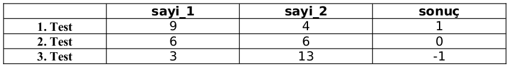
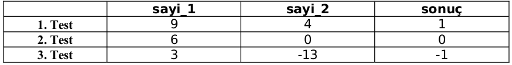

## LABORATUVAR ÇALIŞMASI 5 - Değer Döndüren Fonksiyonlar

### Bu Çalışmanın Amacı 

Bu çalışmadaki amacımız, "Değer Döndüren Fonksiyonlar" ve "Bir Fonksiyonu Diğer Br Fonksiyona Argüman Olarak Geçirme" konularında öğrendiklerimizi pekiştirmektir.

### Fonksiyonlar 

Fonksiyonları argüman alıp - almamasına ve değer döndürüp döndürmemesine göre incelersek, şu örneklere bakmamız faydalı olacaktır:

* Argüman alan ve değer döndüren fonksiyon **->**  Arkadaşınıza, bozması için 1 TL **veriyorsunuz** ve o da size iki tane 50 Kuruş **veriyor**

* Argüman alan ancak değer döndürmeyen fonksiyon **->** Arkadaşınıza önceden 1 TL borcunuz vardı, ödemek için 1 TL **veriyorsunuz** ama ondan herhangi birşey almıyorsunuz.

* Argüman almayan ancak değer döndüren fonksiyon **->** Arkadaşınıza bir şey vermeden ondan 1 TL borç istiyorsunuz ve size 1 TL **veriyor**.

* Argüman almayan ve değer döndürmeyen fonksiyon **->** Arkadaşınıza önceden 1 TL borcunuz vardı, ondan bu borcu silmesini istiyorsunuz ve o da artık kendisine borçlu olmadığınızı söylüyor. Herhangi bir şey alıp - vermiyorsunuz.

Yukarıdaki örneklerde bahsedilen paraları **argüman**, arkadaşınıza söylemiş olduğunuz "Bu parayı bozar mısın?", "Sana borcum vardı, bu parayı alır mısın?", "Bana borç verir misin?", ve "Sana olan borcumu siler misin?" ifadelerini ise **fonksiyon çağrısı** olarak düşünebiliri.

### Fonksiyon Çağrıları

Fonksiyon çağrısı, **fonksiyon ismini** ve ismin sağ tarafında yer alan parantezlerin içerisine **fonksiyonun aldığı argümanları** sırasıyla yazarak yapılır (Eğer fonksiyon argüman almıyorsa parantezlerin içi boş bırakılır.). Bu fonksiyon değer döndüren bir fonksiyon ise, fonksiyonun isminin sol tarafına "=" işareti, onun da soluna herhangi isimde bir değişken
konularak, fonksiyonun döndürdüğü değerin, bu değişkenin içerisine atılması sağlanmış olur. Değer döndüren bir fonksiyonun sol tarafına "=" işareti ve değişken koyarak atama işlemi **yapmazsak**, **fonsiyonun döndürdüğü değeri ihmal etmiş oluruz.** Bu durumda fonksiyonun döndürdüğü değer de ekrana yazılacaktır. Aşağıdaki örneği incleyerek bunu somutlaştırabiliriz:

~~~~{.python}
>>> a = '77'
>>> type(a)
<type 'str'>
>>> deger = int(a)
>>> deger 
77
>>> int(a)
77
~~~~
Bu örnekte “a” değişkeninin içerisine, **karakter dizisi olarak** “ '77' ” değeri atılmıştır. Python’ da, aldığı değerleri tamsayıya dönüştüren (dönüştürememesi durumunda uyarı veren) “**int()**” fonksiyonu var olup, değer olarak dönüşümün sonucunu döndürmektedir. Yukarıdaki kod dizisinde dördüncü satıra baktığımız zaman “**int()**” fonksiyonunun, “a” yı tamsayıya dönüştürerek “deger” değişkeninin içerisine attığını görürüz. Bu durumda ekrana herhangi bir şey yazılmayacaktır ve “deger” isimli değişkenin değeri **tamsayı** olarak 77 olacaktır. Yedinci satırda ise “**int()**” fonksiyonunun döndürdüğü değer herhangi bir değişkenin içerisine atılmadığından ihmal edilmiştir. Bu durumda ise Python yorumlayıcısı dönen bu değeri ekrana yazdıracaktır.

Yukarıdaki paragrafta incelemiş olduğumuz ve bir **tür dönüştürme fonksiyonu** olan “**int()**” fonksiyonundan başka “**float()**” ve “**str()**” fonksiyonlarından da bahsedebiliriz. “**float()**” fonksiyonu da parantezleri arasına girilen değeri ondalıklı sayıya dönüştürmeyi dener, başarılı olursa bu dönüşümün sonucunu döndürür, başarısız olursa hata verir. “**str()**” fonksiyonu ise aldığı değeri karakter dizisine dönüştürür. **Bütün sayıların, harflerin ve işaretlerin birer karakter karşılığı olduğu için “str()” fonksiyonu her durumda başarılı olur.** Örneğin, “'j'” karakterini bir tamsayıya ya da ondalıklı sayıya dönüştürmek mümkün değilken; gerek “3.277” ondalıklı sayısını, gerekse “814578” tamsayısını bir karakter dizisine dönüştürmek mümkün olabilmektedir. Aşağıdaki örneği inceleyelim:

~~~~{.python}
>>> a = 'karakter'
>>> b = 500
>>> c = 12.34
>>> d = '500'
>>> e = '12.34'
>>> int(a)
***Hata MEsajı***
>>> float(a)
***Hata MEsajı***
>>> str(a)
'karakter'
>>> int(b)
500
>>> float(b)
500.0
>>> str(b)
'500'
>>> int(c)
12
>>> float(c)
12.34
>>> str(c)
'12.34'
>>> int(d)
500
>>> float(d)
500.0
>>> str(d)
'500'
>>> int(e)
***Hata MEsajı***
>>> float(e)
12.34
>>> str(e)
'12.34'
~~~~

İçerisinde karakter bulunan değerlerin tamsayıya ya da ondalıklı sayıya dönüştürülmesi sırasında hata ile karşılaşmamızın nedeni, karakterlerin sayı değeri taşımamasıdır. "**int()**" fonksiyonu ise  ondalıklı bir sayıyı tamsayıya dönüştürürken yuvarlama yapmasına karşın ondalıklı sayı formatında yazılmış olan karakter dizilerinin tamsayıya dönüştürülmesini desteklememektedir. Diğer dönüşümlerde ise sorun bulunmamaktadır.

### Değer Döndüren Fonksiyonlar

Yazdığımız fonksiyonun çeşitli işlemler ve hesaplamalar sonucunda bir değer üreterek bunu döndürmesini istiyorsak "**return**" komutunu kullanmamız gerektiğine değinmiştik. Şimdi bunu örnek kod üzerinde görelim:

~~~~{.python}
def mutlak_deger(tamsayi):
	if tamsayi < 0:
		sonuc = tamsayi * (-1)
	else:
		sonuc = tamsayi
	return sonuc
~~~~

Yukarıda, kendisine argüman olarak verilen tamsayıların mutlak değerini alan bir fonksiyon verilmiştir. "**tamsayi**" değerine göre şartlı işlem yapılarak her şart için hesaplanan değer "**sonuc**" değişkeni içerisine atılmakta ve fonksiyon da bu **sonuc** değişkeninin değerini döndürmektedir. Örnek kullanım:

~~~~{.python}
>>> mutlak_deger(6)
6
>>> mutlak_deger(-9)
9
>>> mutlak_deger(0)
0
~~~~

### Bir Fonksiyonu Diğer Bir Fonksiyona Argüman Olarak Geçirme

Python' da fonksiyonlar; tıpkı tamsayılar, karakter dizileri, sözcükler gibi ayrı birer türüdür (tür adı: **function**). Bunu, aşağıdaki örnek Python Shell ekranına bakarak da anlayabiliriz:

~~~~{.python}
>>> def kare_al(sayi):
	return sayi*sayi

>>> type(kare_al)
<type 'function'>
~~~~

Nasıl ki içerisinde tamsayı bulunan bir değişkenin ismi aslında o tamsayının bellekte bulunduğu yerin adresi ise aynı durum fonksiyon isimleri için de geçerlidir. Fonksiyonlar da aslında bellekte saklanan program parçacıklarıdır ve bellek üzerinde belli bir adresleri vardır. Yukarıdaki kutucukta yer alan "**kare_al**" fonksiyonunun bellekte yer aldığı adres, bir bakıma, "kare_al" isimli bir değişkende tutulmaktadır.

Fonksiyonların adreslerini bilmemiz, bize bir fonksiyona diğer bir fonksiyonun ismini **argüman olarak geçirme** şansını verir. Aşağıdaki betik örneğini inceleyelim:

~~~~{.python}
def kok_al(sayi):
	return sayi**0.5

def kare_al(sayi):
	return sayi**2

def kup_al(sayi):
	return sayi**3

def islem_yap(fonk_adi, sayi)
	return fonk_adi(sayi)
~~~~

F5 ile Python Shell ekranına gelelim:

~~~~{.python}
>>> islem_yap(kok_al, 9)
3.0
>>> islem_yap(kare_al, 9)
81
>>> islem_yap(kup_al, 9)
729
~~~~

Görüldüğü gibi "**islem_yap**" fonksiyonu, diğer fonksiyonların isimlerini argüman olarak alıp, bu fonksiyonları çağırmak suretiyle değer hesaplamakta ve döndürmektedir.

### Alıştırmalar 

### Alıştırma - 1 

**Görev**

Python' da gerek değişkenlerin, gerekse değişkenlerin içerisine atana değerlerin **tür**lerini döndüren "**type**" fonksiyonunu daha önceki bölümlerde incelemiştik. Aşağıdaki kutuyu inceleyiniz ve "**type**" fonksiyonunu **argüman alma** ve **değer döndürme** bakımından gözlemleyiniz. Değer döndürüp-döndürmediğini, döndürüyor ise döndürdüğü değerin türünü belirtiniz.

~~~~{.python}
>>> a = 60
>>> type(a)
<type 'int'>
>>> b = type(a)
>>> b
<type 'int'>
>>> c = type(b)
>>> c
<type 'type'>
~~~~

**İpucu**

"Fonksiyonlar" ve "Fonksiyon Çağrıları" bölümlerini inceleyiniz.

**Sonuç**

Gerçekleştiriminizi ve / veya karşılaştığınız problemleri raporunuza yazınız.

### Alıştırma - 2 

**Görev**

"**lab05_kiyasla.py**" isimli betik dosyası oluşturarak içerisinde "**kiyasla**" isminde; "**sayi_1**" ve "**sayi_2**" isminde iki argüman alan bir fonksiyon hazırlayınız **(kiyasla(sayi_1, sayi_2))**. Fonksiyonunuz, '**sayi_1 > sayi_2**' olması durumunda "**1**", '**sayi_1 < sayi_2**" olması durumunda "**-1**", "**sayi_1 == sayi_2**" olması durumunda ise "**0**" değerini **döndürmelidir**. Ayrıca, fonksiyonunuza **doctest** kullanımı da ekleyiniz. Fonksiyonunuzda doctest kullanımı sırasında test etmeniz gereken değerler ve sonuçları şöyle olmalıdır:

**İpucu**

Üç tırnak işaretleri arasında doctest için gereken test işlemlerini belirttikten sonra betik dosyasının başına "**import doctest**", sonuna da "**doctest.testmod()**" (girintisiz biçimde) yazılarak test işlemi gerçekleştirilebilir:

~~~~{.python}
import doctest

def fonksiyon(arg_1, arg_2, ...):
	"""
	....
	....
	"""
	........
	........

doctest.testmod()
~~~~

**Sonuç**

Gerçekleştiriminizi ve / veya karşılaştığınız problemleri yazınız.

### Alıştırma - 3 

**Görev** 

"**lab05_isaret_kontrol.py**" isimli betik dosyası oluşturarak içerisinde "**isaret_kontrol**" isminde; "**sayi_1**" ve "**sayi_2**" isminde iki argüman alan bir fonksiyon hazırlayınız (**isaret_kontrol(sayi_1, sayi_2)**). Fonksiyonunuz, '**sayi_1 * sayi_2**' çarpımının **pozitif** olması durumunda '**1**', **negatif** olması durumunda '**-1**', **sıfır (0)** olması durumunda ise "**0**" değerini **döndürmelidir**. Ayrıca, fonksiyonunuza **doctest** kullanımı da ekleyiniz. Fonksiyonunuzda doctest kullanımı sırasında test etmeniz gereken değerler ve sonuçları şöyle olmalıdır:

**Sonuç**

Gerçekleştiriminizi ve / veya karşılaştığınız problemleri raporunuza yazınız.

### Alıştırma - 4

**Görev**

"**lab05_fonk_genel.py**" isimli betik dosyası oluşturarak içerisine 'Alıştırma - 2' ve 'Alıştırma - 3' te hazırlamış olduğunuz "**kiyasla**" ve "**isaret_kontrol**" fonksiyonlarınızı **kopyalayınız** (doctest kullanmadan). Daha sonra, betik dosyanızın içerisine "**fonk_genel**" isminde bir fonksiyon ekleyiniz. Bu fonksiyon, "Bir Fonksiyonu Diğer Bir Fonksiyona Argüman Olarak Geçirme" başlığı altındaki örnektekine benzer biçimde, 1. argüman olarak diğer iki fonksiyondan herhangi birinin adını alabilmeli, 2. ve 3. argümanlarla verilen iki sayı değerini de alarak, **ilk argümanda hangi fonksiyonun adı verilmişse** aldığı iki sayıya o fonksiyon üzerinde işlem yaptırarak sonucu döndürmelidir. Betik dosyasında iken F5 tuşuna basılarak Python Shell ekranına gelindiğinde örnek kullanım aşağıdaki gibi olacaktır:

~~~~{.python}
>>> fonk_genel(kiyasla, 3, 13)
-1
>>> fonk_genel(isaret_kontrol, 3, 13)
1
>>> fonk_genel(kiyasla, 3, -13)
1
>>> fonk_genel(isaret_kontrol, 3, -13)
-1
~~~~

**Sonuç** 

Gerçekleştiriminizi ve / veya karşılaştığınız problemleri raporunuza yazınız.

## GASP İLE ŞEKİL ÇİZİM ÖDEVİ - 2

Bu ödevde sizden, Python’ da grafiksel uygulamalar yapmamıza olanak sağlayan **GASP** modülünden faydalanarak, isim ve not bilgileri girilen öğrenciler için **isim – skor tablosu** çizebilen ve skorları, öğrencinin notu (0-100 aralığında bir tamsayı) ile doğru orantılı uzunluklardaki çizgilerle (ya da dikdörtgensel bölgelerle) ifade edebilen bir program yazmanız beklenmektedir.

Programınız, en az 5 öğrencinin isim – skor bilgilerini listeleyebilecek nitelikte olmalıdır. Program çalıştırıldığında ilk başta, not bilgileri girilecek olan **öğrenci sayısını** sormalıdır. Daha sonra, **öğrenci sayısı defa öğrenci ismi ve öğrenci notu** bilgilerini sormalı, en sonunda ise bu öğrencilerin **isim** ve **skor** bilgilerini bir tablo üzerinde grafiksel olarak göstermelidir. Programınızı, “**bil_prog05_skor.py**” isimli betik dosyasına kaydetmeniz beklenmektedir. Betik dosyanızda fonksiyon tanımlamak ya da tanımlamamak sizin tercihinize bağlıdır. Aşağıdaki kutuda, programın Python Shell ekranında çalıştırılması esnasında girilen değerlere ait görüntüler yer almaktadır:

~~~~{.python}
Lutfen ogrenci sayisini giriniz		: 5

Ogrenci ismini giriniz			: Damla
Bu ogrencinin notunu giriniz (0-100)	: 88

Ogrenci ismini giriniz			: Sedat
Bu ogrencinin notunu giriniz (0-100)	: 75

Ogrenci ismini giriniz			: Turgut
Bu ogrencinin notunu giriniz (0-100)	: 14

Ogrenci ismini giriniz			: Osman
Bu ogrencinin notunu giriniz (0-100)	: 60
~~~~

Girilen bu bilgiler için çizdirilmesi beklenen grafik, aşağıdakine benzer bir yapıda olmalıdır:

Şunları unutmayınız:

* Çizgilerin/dikdörtgenlerin ve yazıların renklerini ve konumlarını sizin belirlemeniz gerekmektedir. Bu işlemleri, “Box”, “Line” (İstediğinizi tercih edebilirsiniz.) fonksiyonlarını kullanırken yapmanız gerekmektedir.

* Arka planın rengini değiştirmek zorunda değilsiniz; ancak değiştirmek isterseniz bu işlemi “begin_graphics” fonksiyonuna argüman vermek sureti ile yapabilirsiniz. Bunu yapmazsanız, arka plan rengi varsayılan değer olarak beyaz kalacaktır.

* Fonksiyonunuzu “**bil_prog05_skor.py**” isimli bir betik dosyasına kaydediniz.

* Betik dosyanızda fonksiyon tanımlamadan önce kullanmanız gereken sınıf(lar)ı çağırmayı unutmayınız.

* **Bütün gerçekleştirim işlemlerini betik dosyasında tamamlamanız gerektiğini, Python Shell ekranına herhangi bir kod/fonksiyon yazmamanız gerektiğini, betik dosyasında iken “F5” tuşuna basıldığında önce Python Shell ekranında sizden bilgilerin istenmesi gerektiğini, sonra da bu bilgiler doğrultusunda GASP ile çizilmiş isim-skor grafiğinin gösterilmesi gerektiğini unutmayınız.**

* **Programlarınızda ne kadar çok hata kontrolü yaparsanız (örneğin, bu programda öğrenci sayısının 7.8 ya da -9 girilmesi durumunda kullanıcıya uyarı mesajı vermek gibi), programınız o kadar sağlıklı çalışacaktır. Ayrıca, yapacağınız hata kontrolleri ve bunun sonucunda elde edeceğiniz daha sağlam program, ödevlerinizin değerlendirilmesinde notunuza olumlu katkı sağlayacaktır.**

