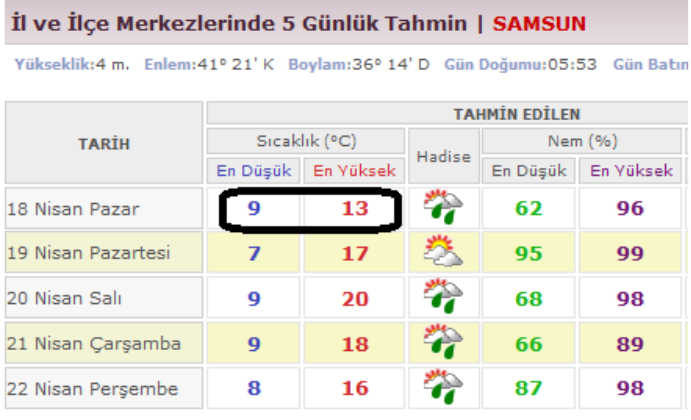
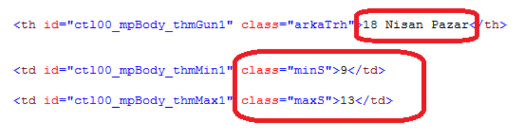
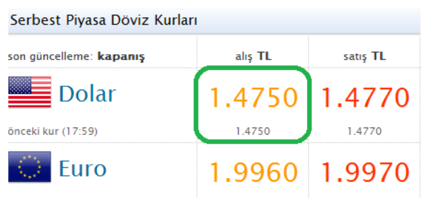

## LABORATUVAR ÇALIŞMASI 7 - For Döngüsü, Karakter Dizileri

### Bu Çalışmanın Amacı

Bu çalışmadaki amacımız; for döngüsü, karakter dizileri, karakter dizileri üzerinde yapılan işlemler ve fonksiyonlarda varsayılan argümanların kullanımı konularında öğrendiklerimizi pekiştirmektir.

### For Döngüsü

"**for**" döngüsünün **while** döngüsünden tek farkı, **hem kriter geçerliliği kontrolünün, hem de kriterde kullanılan değişkenlerin değerlerinin güncellenmesi işleminin aynı satırda (for komutunun bulunduğu satırda) yapılıyor olmasıdır.** Bu konuyu örnekle açıklamak daha yararlı olacaktır. Daha önceden **while** komutu kullanarak hazırlamış olduğumuz dikdörtgen çizme fonksiyonunu bu kez de **for** komutlarını kullanarak gerçekleştirelim:

~~~~{.python}
def dikdortgen_ciz(en, boy):
	isaret = ''
	for i in range(0, en):
		isaret = isaret + '*'
	for j in range(0, boy):
		print isaret
~~~~

Üsttki **for** döngüsünde, "i" isimli bir değişken tanımlanmış (istediğimiz ismi verebiliriz.) bu **i** değişkeni için **0** ile "**en**" değişkeninin değeri aralığında değerler belirlenmiştir. Yani, "en" değeri 6 olarak girildiyse bu, "i = 0 için bir kere çalış, daha sonra i = 1 için bir kere daha çalış, daha sonra i = 2 için ...., son olarak da i = 5 için çalış" anlamına gelmektedir. **range** içerisindeki alt değerin (0) dahil, üst değerin (6) ise hariç tutulduğunu unutmamalıyız. Bu döngü tamamlandığında ise "isaret" değişkeninin içeriği "******" olacaktır.

Benzer şekilde, örneğin "boy" değeri 4 ise alttaki **for** döngüsü de 4 kez çalışacaktır. Programın örnek kullanımı ise **while** örneğindeki kullanımla aynı olacaktır:

~~~~{.python}
>>> dikdortgen_ciz(6, 4)
******
******
******
******
>>> dikdortgen_ciz(3, 5)
***
***
***
***
***
~~~~

**Break Komutu**

Herhangi bir **for** ya da **while** döngüsünden çıkmak için kullanılır. Aşağıdaki betik dosyasını inceleyelim:

~~~~{.python}
while True:
	komut = raw_input('Siz TAMAM yazana kadar bu program sonlanmayacak. Birşeyler yaziniz: ')
	if komut == 'TAMAM':
		break
	print '\nYAZDIGINIZ SEY :', komut, '\n'
print '\nPROGRAM SONLANDI !'
~~~~

Bu betik dosyasının örnek kullanımı ise şu şekildedir:

~~~~{.python}
>>>
Siz TAMAM yazana kadar bu program sonlanmayacak. Birseyler yaziniz : Merhaba

YAZDIGINIZ SEY : Merhaba

Siz TAMAM yazana kadar bu program sonlanmayacak. Birseyler yaziniz : 43210

YAZDIGINIZ SEY : 43210

Siz TAMAM yazana kadar bu program sonlanmayacak. Birseyler yaziniz : Tamam

YAZDIGINIZ SEY : TAMAM

Siz TAMAM yazana kadar bu program sonlanmayacak. Birseyler yaziniz : TAMAM

PROGRAM SONLANDI !
~~~~

Görüldüğü gibi **break** komutu, bizim istediğimiz herhangi bir şartın sağlanması durumunda anında döngü içerisinden çıkmamızı sağlamaktadır.

### Karakter Dizileri

Bir veri türü olan karakter dizileri (**string**), bir veya birden fazla karakterin (boşluk karakteri de dâhil) arka arkaya gelmesinden oluşurlar ve değişken tanımlama esnasında tek tırnaklar ya da çift tırnaklar arasında ifade edilirler. Karakter dizileri, içerdikleri karakter adedi kadar uzunluk değerine sahiptirler. Bunların haricinde, içerisinde hiçbir karakter bulunmayan, sıfır uzunluk değerine sahip olan karakter dizileri de vardır. Eğer bir değişkene atama yaparken, eşitliğin sağındaki değeri tırnak içerisinde yazarsak Python yorumlayıcısı bu değişkenin türünü **karakter dizisi** olarak belirleyecektir.

~~~~{.python}
>>> marka = "VOLVO"
>>> model = 's80'
>>> yil =  "2005"
>>> ipotek = ''
>>> type(marka)
<type 'str'>
>>> type(model)
<type 'str'>
>>> type(yil)
<type 'str'>
>>> type(ipotek)
<type 'str'>
~~~~

Yukarıda yer alan **ipotek** değişkeni, sıfır birim uzunluğunda bir karakter dizisidir. Karakter dizilerinin istediğimiz elemanına (herhangi bir karakterine) istediğimiz zaman, aşağıdaki gibi erişebiliriz:

~~~~{.python}
>>> dil = 'PYTHON'
>>> print dil[0]
P
>>> print dil[3]
H
>>> print dil[-1]
N
>>> print dil[0.71]
***Hata Mesajı***
>>> print dil[19]
***Hata Mesajı***
~~~~

Karakter dizisi içeren değişkenin herhangi bir sıradaki karakterine ulaşmak için gireceğimiz indeks değeri **tamsayı** olmalıdır ve mutlak değeri, değişken uzunluğunun **altında** olmalıdır. Negatif değer girildiğinde ise indeksleme **sağdan sola** doğru yapılır.

Bir karakter dizisinin uzunluğunu öğrenmek için "**len**" fonksiyonunu kullanabiliriz:

~~~~{.python}
>>> dil = 'PYTHON'
>>> uzunluk = len(dil)
>>> uzunluk
6
>>> type(uzunluk)
<type 'int'>
~~~~

**len** fonksiyonu, argüman olarak aldığı karakter dizisinin uzunluğunu **tamsayı** olarak döndürmektedir. Unutulmamalıdır ki Python' da indekslemem 0' dan başlar. Yani "PYTHON" sözcüğünün ilk harfi olan "P" harfi, bu sözcüğün birinci değil **sıfırıncı** harfi olarak kabul edilir. Bu nedenle, programlama yaparken karakter dizisinin ilk karakterinin indeksinin '**0**', son karakterinin 
'**uzunluk - 1**' olduğu unutulmamalıdır:

~~~~{.python}
>>> dil = 'PYTHON'
>>> uzunluk = len(dil)
>>> print dil[uzunluk - 1]
N
>>> print dik[uzunluk]
***Hata Mesajı***
~~~~

Karakter dizileri üzerinde karakter karakter işlem yapmak için **while** ve **for** komutlarından yararlanabiliriz. Bir karakter dizisinin her bir karakterini alt alta yazdırmak için aşağıdaki örnek betik dosyasını kullanabiliriz :

~~~~{.python}
meyve = 'incir'
indeks = 0
while indeks < len(meyve):
	karakter = meyve[indeks]
	print karakter
	indeks = indeks + 1
~~~~

F5 tuşuna bastığımızda ekranda göreceğimiz çıktı ise sağdaki gibi olacaktır:

~~~~{.python}
>>>
i
n
c
i
r
~~~~

Aynı işlemi, "**for[karakter] in [karakter dizisi]**" kalıbı ile de yapabiliriz:

~~~~{.python}
meyve = 'incir'
for karakter in meyve:
	print karakter
~~~~

F5 tuşuna bastığımızda ekran çıktısı önceki kodla aynı olacaktır.

Bu kalıp, karakter dizisini **adım adım** gezerek her bir değeri **karakter** değişkenine atacaktır. Aynı kalıpla gerçekleştirebileceğimizi diğer bir örnek:

~~~~{.python}
basharfler = "BÇKMSTYZ"
govde = 'at'

for karakter in basharfler:
	print karakter + govde
~~~~

F5 tuşuna bastığımızda ekranda göreceğimiz çıktı ise sağdaki gibi olacaktır:

~~~~{.python}
>>> 
Bat
Çat
Kat
Mat
Sat
Tat
Zat
~~~~

Karakter dizisini dilimlere ayırmak da mümkündür. Sonuç olarak **karakter dizisi** döndüren dilimleme komutlarının örnek açıklaması şu şekildedir:

**sozcuk[: 3] ->** Sözcüğün **3.** karakterine kadar (**3. karakter hariç**) olan tüm karakterler (**0**, **1** ve **2** numaralı karakterler)

**sozcuk[3 :] ->** Sözcüğün **3.** karakterinden sonraki (**3. karakter de dahil**) tüm karakterler (**3**, **4**, **5**, ....., **[uzunluk - 1]**)

**sozcuk[2 : 5] ->** Sözcüğün **2.**, **3.**, **4.** karakterleri

**sozcuk[:] ->** Sözcüğün tamamı

**sozcuk[4 : 4] ->** Sonuçta boş bir karakter dizisi dönecektir.

Örnek kullanımı inceleyelim:

~~~~{.python}
>>> deniz = 'Karadeniz'
>>> deniz[: 4]
'Kara'
>>> deniz[4 :]
'deniz'
>>> deniz[3 : 7]
'aden'
>>> deniz[:]
'Karadeniz'
>>> deniz[5 : 5]
''
>>> hece = deniz[2 : 4]
>>> hece
'ra'
>>> type(hece)
<type 'str'>
~~~~

Herhangi bir karakter dizisinin herhangi bir karakterini alarak eğer küçük harfli ise büyük harfe dönüştürmek için “**upper()**” fonksiyonu kullanılır. **upper** fonksiyonu orijinal karakter dizisinde herhangi bir değişiklik **yapmaz**, sadece büyük harfe çevirdiği kısmı **yeni bir karakter dizisi olarak döndürür**:

~~~~{.python}
>>> model = 'bmw730d'
>>> basharf = model[0].upper()
>>> basharf
'B'
>>> type(basharf)
<type 'str'>
>>> model[3 :].upper()
'730D'
>>> model.upper()
'BMW730D'
~~~~

Bir karakter dizisinin içerisinde başka bir karakter dizisinin bulunup – bulunmadığını “**find()**” fonksiyonu ile öğrenebiliriz. Eğer bulunursa kaçıncı indeksten itibaren yer aldığına dair başlangıç indeksinin numarasını, bulunamaz ise de **-1** döndürür. **find** fonksiyonuna, karakter dizisinin hangi indeksleri aralığında arama yapacağını da parametre olarak verebiliriz. Aşağıdaki örneği inceleyelim:

~~~~{.python}
>>> sozcuk = 'istihza'
>>> sozcuk.find('t')
2
>>> sozcuk.find('ihz')
3
>>> sozcuk.find('ihz')
-1
>>> sozcuk.find('i')
0
>>> sozcuk.find('i', 1)
3
~~~~

Dördüncü işlemde '**i**' karakteri, "**istihza**" sözcüğünün 2. karakterinden (Python' a göre 1. karakterinden) itibaren aranmış olduğu için aramaya "s" harfinden başlamış ve ikinci "i" harfine rastlanarak indeks değeri **3** olarak hesaplanmıştır. Beşinci işlemde ise "**i**" karakteri, dizinin sadece 2. ve 3. karakterleri içerisinde aranmış ve bulunamadığı için **-1** elde edilmiştir.

Bir karakter dizisinin içerisinde başka bir karakter dizisinin bulunup - bulunmadığını öğrenmek için "**in**" operatörü kullanılır. Sonuç olarak "**bool**" türünde olan "**True**(Doğru)", ya da "**False**(yanlış)" değerlerinden birini döndürür:

~~~~{.python}
>>> sozcuk = 'istihza'
>>> 'a' in sozcuk
True
>>> 'p' in sozcuk
False
>>> 'ihz' in sozcuk
True
>>> 'ihs' in sozcuk
False
~~~~

Karakter dizileri arasında **eşitlik**, **büyük/küçük/büyük eşit/küçük eşit olma** durumlarını kontrol etmek mümkündür. İki sözcükten **sözlük sırasına göre** sonra gelen, diğerlerinden daha **büyüktür**:

~~~~{.python}
>>> sozcuk1 = 'yalan'
>>> sozcuk2 = 'yanlis'
>>> sozcuk3 = 'yanilma'
>>> sozcuk4 = 'yanilis'
>>> sozcuk5 = 'yanlis'
>>> sozcuk1 > sozcuk2
False
>>> sozcuk1 == sozcuk2
False
>>> sozcuk1 < sozcuk2
True
>>> sozcuk2 == sozcuk5 > sozcuk3 > sozcuk4 > sozcuk1
True
>>> sozcuk2 == sozcuk5 > sozcuk3 > sozcuk4 < sozcuk1
False
>>> sozcuk3 > sozcuk4 == sozcuk1
False
~~~~

**NOT:** Bu sıralama ASCII kullanılarak yapıldığı ve Türkçe karakterlerin ASCII değerleri alfabetik sıralamaya uygun olmadığı için karşılaştırma işlemlerinde Türkçe karakter kullanmaktan uzak durmalıyız.

### Karakter İşlemleri ve İnternet Sayfaları

Her gün defalarca açıp incelediğimiz internet sayfaları, aslında belirli formatta yazılmış kodlardan ibarettir. Bu da, bu sayfaların belirli bir düzene göre sıralanmış **karakterlerden** meydana gelmesi sonucunu doğurur. Örneğin, Devlet Meteoroloji İşleri' nin internet sayfasında Samsun ili için hava durumunun yer aldığı sayfayı internet tarayıcımızla açarak (http://www.dmi.gov.tr/tahmin/il-ve-ilceler.aspx?m=SAMSUN) "**Kaynağı Göster** dediğimizde binlerce karakterden oluşan bir kod dosyası göreceğiz. Samsun ilinin en yüksek ve en düşük sıcaklıklarına ait sayısal değerler de bu kod dosyasında belirli bir yerde bulunmaktadır. Örneğin, ilgili sayfada, bir sonraki güne ait tahmin edilen sıcaklıklara ait değerleri,

sayfanın kaynak kodunun bulunduğu dosyada bulabiliriz:

Burada "**minS**" ve "**naxS**" karakter dizileri, sıcaklık verilerinin dosyanın neresinde tutulduğuna dair bilgi vermektedirler. **Karakter dizileri üzerinde işlem yaparken kullandığımız fonksiyonlardan faydalanarak** Samsun' un en düşük ve en yüksek sıcaklıklarını yazdırabilmemize olanak sağlayan kodu inceleyelim:

~~~~{.python}
# -*- coding: utf-8 -*-
# http://www.dmi.gov.tr/tahmin/il-ve-ilceler.aspx?m=SAMSUN

import urllib2
sehir = "SAMSUN"

page = urllib2.urlopen("http://www.dmi.gov.tr/tahmin/il-ve-ilceler.aspx?m =" + sehir)
text = page.read().decode("utf8")

kb = text.find('"minS"')
sb = text.find(">", kb) + 1
ss = text.find("<", sb)
minS = int(text[sb:ss])

kb = text.find('"maxS"')
sb = text.find(">", kb) + 1
ss = text.find("<", sb)
maxS = int(text[sb:ss])

print "%s icin hava durumu:\nmin = %s, max = %s" % (sehir, minS, maxS)
~~~~

Bu kodda **urllib2** kütüphanesi kullanılarak ilgili sayfanın **kaynak kod dosyası**, "**text**" isimli bir değişkenin ("unicode" türünden bir değişken olup, üzerinde karakter işlemleri yapılabilmektedir.) içerisine atılmıştır. Daha sonra, karakter dizileri üzerinde yapılan işlemlerden faydalanılarak, sıcaklık bilgileri elde edilmiş ve ekrana yazdırılmıştır. Yukarıdaki kod bit betik dosyasında çalıştırıldığında görülecek olan ekran çıktısı aşağıdaki gibidir:

~~~~{.python}
>>>
SAMSUN icin hava durumu :
min = 9, max = 13
~~~~

**NOT: Bu başlık altında anlatılan işlemlerin gerçekleştirilebilmesi için, bilgisyarımızın internete bağlı olması gerekmektedir.**

### Fonksiyonlarda Varsayılan Argümanların Kullanımı

Argüman alan bir fonksiyon tanımladığımızda, bu fonksiyonu çağırırken argümanlarına istediğimiz değerleri girebileceğimizi daha önceki konularda ele almıştık. Ancak, Python’ da bir fonksiyona “**Argüman olarak bir değer girersem onu kullan, hiçbir değer girmezsem de şu değeri girmişim gibi kabul et ve onu kullan.**” dememiz de mümkündür. Anlatıma açıklık getirmek adına aşağıdaki örneği inceleyebiliriz:

~~~~{.python}
def dikdortgen_ciz(en=5, boy=3):
	isaret = ''
	for i in range(0, en):
		isaret = isaret + '*'
	for j in range(0, boy)
		print isaret
~~~~

Bu fonksiyon ile 6 x 2' lik bir dikdortgen çizdirmek için normal bir biçimde argüman verebiliriz:

~~~~{.python}
>>> dikdortgen_ciz(6, 2)
******
******
~~~~

Eğer bu fonksiyonu **hiçbir argüman vermeden** çağırırsak, varsayılan değerlerin (**en** için **5**, **boy** için **3**) hesaba katıldığını göreceğiz:

~~~~{.python}
>>> dikdortgen_ciz()
*****
*****
*****
~~~~

Eğer bu fonksiyona tek bir argüman verirsek, **bunu ilk argüman olarak kabul edecek ve ikinci argümanın varsayılan değerini kullanacaktır** (**boy** değerini **3** olarak kabul edecektir):

~~~~{.python}
>>> dikdortgen_ciz(8)
********
********
********
~~~~

Ayrıca, **varsayılan değere sahip argümanlardan dilediğimize değer girmemiz** de mümkündür. Bunun içinse ilgili argümanın ismini belirtmemiz gerekmektedir:

~~~~{.python}
>>> dikdortgen_ciz(boy = 2)
*****
*****
>>> dikdortgen_ciz(en = 10)
**********
**********
**********
~~~~

Bir fonksiyonun tüm argümanlarının varsayılan değeri bulunabileceği gibi, fonksiyonlarda argümanlardan sadece bazılarının varsayılan değere sahip olmaları da mümkündür:

~~~~{.python}
def dikdortgen_ciz(en, boy = 3}:
	isaret = ''
	for i in range(0, en):
		isaret = isaret + '*'
	for j in range(0, boy):
		print isaret
~~~~

Bu şekildeki fonksiyonlarda, varsayılan değeri bulunmayan argümanları mutlaka değer girilmelidir. Yukarıdaki fonksiyona tek bir argüman verilirse bu, varsayılan değere sahip olmayan **en** yerine geçecektir:

~~~~{.python}
>>> dikdortgen_ciz(7)
*******
*******
*******
~~~~

Bu fonksiyon, argüman girilmeden çağrıldığında ise **en** değeri bilinmeyeceği için hata mesajı ile karşılaşılacaktır:

~~~~{.python}
>>> dikdortgen_ciz()
***Hata Mesajı***
~~~~

### Alıştırmalar 

### Alıştırma - 1

**Görev**

Çarpma işlemi yapmadan, **sadece toplama işlemi yaparak** **0**' dan bir **pozitif** **n** tamsayısına kadar olan tamsayıların toplamını (1 + ... + n) hesaplayan bir fonksiyon tanımlayınız. Fonksiyon, **n** tamsayısını parametre olarak almalı ve **pozitif bir tamsayı girilmediğinde** "Lütfen pozitif bir tamsayi giriniz." uyarı mesajını yazdırmalıdır. Fonksiyonunuza "**ardisik_toplam**" ismini vererek "**lab07_ardisik_toplam.py**" isimli bir betik dosyasına kaydediniz. Fonksiyonun çalıştırılmasına iat örnek ekran görüntüsü aşağıdadır:

~~~~{.python}
>>> ardisik_toplam(7)
28
>>> ardisik_toplam(0)
Lütfen pozitif bir tamsayi giriniz.
>>> ardisik_toplam(-7)
Lütfen pozitif bir tamsayi giriniz.
>>> ardisik_toplam(7.1)
Lütfen pozitif bir tamsayi giriniz.
~~~~

**Fonksiyonunuza doctest eklemeyi unutmayınız.**

**Sonuç** 

Gerçekleştiriminizi ve / veya karşılaştığınız problemleri raporunuza yazınız.

### Alıştırma - 3 

**Görev**

Bir pozitif tam sayıyı, sayının kendisi defa **sürekli** (bölime işleminin sonucunu da ikiye bölerek devam eden biçimde) ikiye bölen ve sonuç olarak da tüm bölenlerin toplamını döndüren bir fonksiyon yazınız. Örneğin, fonksiyona **3** değeri verildiğinde:

3/2 = **1.5**
	1.5/2 = **0.75**
		0.75/2 = **0.375** (Tamsayı 3 olduğu için 3. basamakta duruldu.)

**1.5** + **0.75** + **0.375** = 2.625

Ancak her bir basamakta hesaplanan **bölüm** değeri **0.1' e eşit ya da 0.1' den küçük olursa** sürekli bölme işlemi o basamakta sona erdirilerek 0.1' den büyük olan bölümler toplanarak döndürülmelidir. Fonksiyona 7 verildiğinde:

7/2 = **3.5**
	3.5/2 = **1.75**
		1.75/2 = **0.875**
			0.875/2 = **0.4375**
				0.4375/2 = **0.21875**
					0.21875/2 = **0.109375**
						0.109375/2 = **0.0546875**
(**0.0546875 sayısı 0.1' den küçük olduğu için hesaba katılmaz.** Böylesi bir durumda sayı 7' den büyük olsaydı ve bölme işleminin devam etmesi gerekseydi bile sürekli bölme işlemi bu noktada kesilmelidir.)

**3.5** + **1.75** + **0.875** + **0.4375** + **0.21875** + **0.109375** = **6.890625**

Programa **pozitif tamsayı dışında** bir sayı girildiğinde ekrana "Lütfen pozitif bir tamsayi giriniz." mesajı yazılmalıdır.

Fonksiyona "**yarilar_toplami**" ismini veriniz ve "**lab07_yarılar_toplami.py**" isimli bir betik dosyasına kaydediniz. Fonksiyonun çalıştırılmasına dair örnek gösterim aşağıdadır:

~~~~{.python}
>>> yarilar_toplami(2)
1.5
>>> yarilar_toplami(3)
2.625
>>> yarilar_toplami(5)
4.84375
>>> yarilar_toplami(7)
6.890625
>>> yarilar_toplami(0)
Lütfen pozitif bir tamsayı giriniz.
>>> yarilar_toplamı(-4)
Lütfen pozitif bir tamsayi giriniz.
>>> yarilar_toplamı(6.8)
Lütfen pozitif bir tamsayi giriniz.
~~~~

**İpucu**

"**break**" komutunu inceleyiniz.

**Sonuç** 

Gerçekleştiriminizi ve / veya karşılaştığınız problemleri raporunuza yazınız.

### Alıştırma - 3

**Görev**

Parameter olarak **Türkçe karakter** (Ç, ç, Ğ, ğ, ı, İ, Ö, ö, Ş, ş, Ü, ü) **içermeyen** bir karakter dizisi alan ve sonuçta o karakter dizisini **tersten** yazılmış halini döndüren bir fonksiyon yazınız. Fonksiyonunuza "**sondan_basa_yaz**" ismini veriniz ve "**lab07_sondan_basa_yaz.py**" isimli bir betik dosyasına kaydediniz. Fonksiyonunuza parametre olarak karakter dizisi dışında bir değer girildiğinde ekrana "Lütfen parametre olarak karakter dizisi giriniz." yazısı yazılmalıdır. Fonksiyon kullanımına dair örnek aşağıdadır:

~~~~{.python}
>>> sondan_basa_yaz('Ondokuz Mayis Universitesi')
'isetisrevinU siyaM zukodnO'
>>> sondan_basa_yaz('')
''
>>> sondan_basa_yaz(45)
Lütfen parametre olarak karakter dizisi giriniz.
>>> sondan_basa_yaz(9.87)
Lütfen parametre olarak karakter dizisi giriniz.
~~~~

**Sonuç**

Gerçekleştiriminizi ve / veya karşılaştığınız problemleri raporunuza yazınız.

### Alıştırma - 4 

**Görev**

Bir karakter dizisi içerisinde her bir karakterden kaç tane bulunduğunun çıkarılması işlemine "histogram çıkarma" denir. Argüman olarak bir karakter dizisi alan ve sonuç olarak ekrana, bu dizi içerisinde hangi karakterden kaçar tane bulunduğunu yazdıran "**histogram**" isminde bir fonksiyon hazırlayarak "**lab07_histogram.py**" isimli betik dosyasına kaydediniz. Programın çalıştırılmasına dair örnek aşağıdadır

~~~~{.python}
>>> histogram('sekiz yüz seksen sekiz')
  : 3
e : 4
i : 2
k : 3
n : 1
s : 4
y : 1
z : 3
ü : 1
~~~~

**Not** Yukarıdaki kutunun ikinci satırında, boşluk karakterinden 2 tane yer aldığı anlaşılmaktadır.

**İpucu**

"**for [karakter] in [karakter dizisi]**" kalıbını ve **sözlük** veri türünü bir arada kullanmayı deneyiniz.

### Alıştırma - 5

**Görev**

Argüman olarak bir **karakter** ve bir **karakter dizisi** alıp, **karakter dizisinin** içerisinde ilgili **karakter** varsa bunları yok ederek, **karakter dizisinin arındırılmış halini** döndüren "**karakterden_arindir**" isimli bir fonksiyon hazırlayınız. Bu fonksiyon için hazırlanmış **doctest** örneği aşağıdadır.

~~~~{.python}
def karakterden_arindir(karakteri, kar_dizisi):
	"""
	>>> karakterden_arindir('a', 'apple')
	pple
	>>> karakterden_arindir('a', 'banana')
	bnn
	>>> karakterden_arindir('z', 'banana')
	banana
	>>> karakterden_arindir('i', 'Mississippi')
	Msssspp
	"""
~~~~

**Sonuç**

Gerçekleştiriminizi ve / veya karşılaştığınız problemleri raporunuza yazınız.

### Alıştırma - 6

Argüman olarak bir iki **karakter dizisi** (bir uzun bir kısa) alıp, *uzun olan karakter dizisinin** içerisinde **kısa olan karakter dizisi** varsa bunları yok ederek, **uzun olan karakter dizisinin arındırılmış halini** döndüren "**diziden_arindir**" isimli bir fonksiyon hazırlayınız. Bu fonksiyon için hazırlanmış **doctest** örneği aşağıdadır.

~~~~{.python}
def diziden_arindir(kisa_dizi, uzun_dizi):
	"""
	>>> diziden_arindir('an', 'banana')
	ba
	>>> diziden_arindir('cyc', 'bicycle')
	bile
	>>> diziden_arindir('iss', 'Missisippi')
	Mippi
	>>> diziden_arindir('eggs', 'bicycle')
	bicycle
	"""
~~~~

**Sonuç** 

Gerçekleştiriminizi ve / veya karşılaştığınız problemleri raporunuzda yazınız.

### Ödev

"Karakter İşlemleri ve İnternet Sayfaları" bölümünü inceleyiniz.

http://www.doviz.com sayfasına girerek, **Amerikan Doları - Alış** bölümünü gözlemleyiniz:

Daha sonra, “Karakter İşlemleri ve İnternet Sayfaları” bölümünde anlatıldığı gibi, bu internet sayfasının kaynak kodundan, **Amerikan Doları - Alış** bilgisinin tutulduğu kısma ulaşarak dolar kurunu belirten sayıyı almak sureti ile, **önce ekrana kur bilgisini yazdıran, daha sonra da eğer kur 1.4’ ten küçükse “Dolar almanin tam zamani”, eğer 1.4’ e eşit ya da 1.4’ ten daha büyükse “Beklemeye devam” yazdıran bir Python programı hazırlayınız.** Programınız kurun 1.4750 olduğu anda çalıştırıldığında aşağıdaki ekran çıktısı gözlemlenmelidir:

~~~~{.python}
kur = 1.475
Beklemeye devam
~~~~

**NOT: Programınızın çalışabilmesi için internet bağlantınızın olması gerektiğini unutmayınız**
