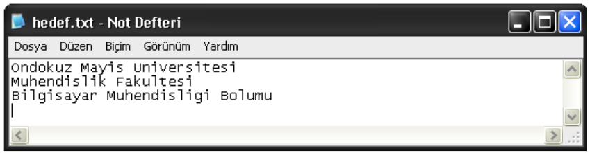
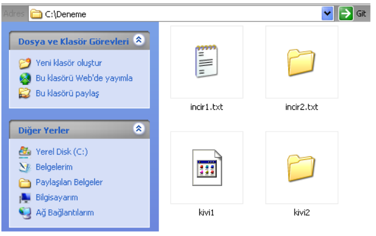
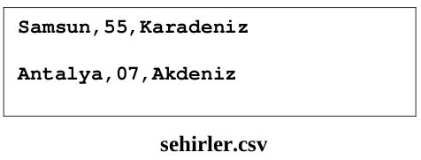
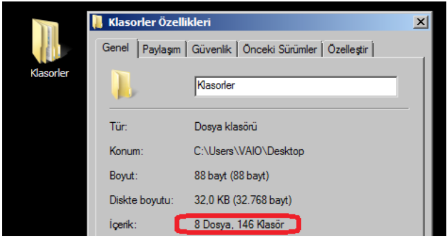

## LABORATUVAR ÇALIŞMASI 9 - Dosyalar ve Modüller

### Bu Çalışmanın Amacı

Bu çalışmadaki amacımız, dosyalar ve modüller konularında öğrendikleriminizi pekiştirmektir.

### Hatırlatma

Bu föy, Windows işletim sistemi üzerinde hazırlandığı için bazı ekran görüntüleri ve klasör isimleri, diğer işletim sistemlerindekilerden farklı görünebilecektir. Örnek olarak verilen dosya ve klasör adreslerinde, kullanmakta olduğunuz işletim sistemini de göz önüne alarak gerekli değişiklikleri yapmanız gerekmektedir (İlerleyen sayfalarda, bazı noktalarda size bilgi verilmiştir.). **Python programlama dilini gerek Linux, gerekse Windows işletim sistemleri üzerinde kullanarak programlama yapabileceğinizi unutmayınız.**

### Dosya İşlemleri

Hazırladığımız bir programı çalıştırarak çeşitli veriler elde ettikten sonra bu verileri daha sonra tekrar kullanmak üzere **kalıcı** olarak saklama ihtiyacı duyabiliriz. Bilgisayarı kapatıp açtıktan sonra dahi verilerimizin kaybolmaması için onları **dosyalara** kaydederek sabit diskte saklamamız gerekir. Verileri dosyalara kaydetmek için dosyaya yazma işlemi, dosyaya kaydedilmiş verilere daha sonradan ulaşmak içinse dosyadan okuma işlemi yapmamız gerekmektedir.

### Dosyadan Okuma İşlemi

Python' da bir dosyayı okuyabilmek için **öncelikle açmak gerekir**. Dosyayı açmak içinse "**open**" fonksiyonu kullanılır. **open** fonksiyonu parametre olarak **dosya adresini** (dosya ismine kadar, 'C:\...\...\...\dosya.txt' gibi) alır, sonuç olaraksa bir **dosya nesnesi** döndürür.

Dosyadan okuma işlemleri, işte bu **dosya nesnesi** üzerinden yapılır. Örneğin, "sozcuk.txt" isminde bir metin dosyamız olsun ve içeriği aşağıdaki gibi olsun :
 
**aba**		
**abajur**	
**abanmak**	
**abanoz**	
**abartmak**	
**abide**	
**abiye**	
**abone**	

Bu dosyanın çalışma dizininde (Python Shell’ de iken Ctrl+O ile ulaştığımız dizinde) bulunduğunu düşünelim ve bu dosyadan satır satır okuma yaparak okunan kelimeleri alt alta ekrana yazdıran bir program hazırlayalım (Python Shell ekranında). **open** fonksiyonunun döndüreceği değeri içerisine atacağımız dosya nesnesine, “dosya girdisi (file input)” anlamında “**fin**” ismini verelim (Genelde bu isim verilir.):

~~~~{.python}
>>> fin = open('sozcuk.txt')
>>> for satir in fin:
	print satir

aba

abajur

...

abone
~~~~

Kodu bu şekilde yazdığımızda sözcüklerin ekrana birer satır arayla yazıldığını görürüz. Bunun nedeni, hem print komutunun her defasında yeni bir satıra yazması, hem de dosyadan okunan her bir sözcüğün sonunda, “Bir alt satıra geç.” anlamına gelen“\r\n” karakterlerinin bulunmasıdır. Metin dosyasında biz bu “\r\n” karakterlerini yazılı olarak görmeyiz, çünkü bu karakterlerin görevi zaten metnin bir alt satırdan devam edeceğini göstermektir. 

**aba\r\n**
**abajur\r\n**
**abanmak\r\n**
**abanoz\r\n**
**abartmak\r\n**
**abide\r\n**
**abiye\r\n**
**abone\r\n**

Eğer “sozcuk.txt” dosyasından bir şekilde bu “\r\n” karakterlerini yok edersek elde edeceğimiz yeni metin dosyasını açtığımızda göreceğimiz şey şu şekilde olacaktır:

abaabajurabanmakabanozabartmakabideabiyeabone

**İlave Bilgi:** "\n" bir alt satıra geçmek, "r" ise satırın başına gelmek için kullanılır. İkiabaabajurabanmakabanozabartmakabideabiyeabone
si beraber "\r\n" biçiminde kullanıldığında bu, "Bir alt satırın en başına git." anlamına gelir.

Ancak "**readline**" komutu ile okuma yaptıktan sonra "**\r\n**" karakterlerini atmak da mümkündür. Bunun içinse "**strip**" fonksiyonu kullanılır. Örnek kullanım aşağıdaki gibidir:

~~~~{.python}
>>> fin = open('sozcuk.txt')
>>> for satir in fin:
	arindirilmis_satir = satir.strip()
	print arindirilmis_satir

aba
abajur
abanmak
abanoz
abartmak
abide
abiye
abone
~~~~

"arindirilmis_satir" değişkeni içerisinde "**\r\n**" karakterlerinden arındırılmış sözcükler bulunduğu için ve **print** komutu her defasında yeni bir satırdan yazmaya başladığı için kelimeler arasında boş satırlar yer almayacaktır.

### Dosyaya Yazma İşlemi 

Python çalışma dizini içerisinde (Python Shell ekranı açıkken Ctrl+O ile görüntülediğimiz dizinde) “hedef.txt” adında bir dosya oluşturarak birinci satırına “Ondokuz Mayis Universitesi”, ikinci satırına “Muhendislik Fakultesi”, üçüncü satırına ise “Bilgisayar Muhendisligi Bolumu” yazdırarak kaydetmek için şu işlemleri yapmamız gerekir:

~~~~{.python}
>>> satir1 = 'Ondokuz Mayıs Universitesi\n'
>>> satir2 = 'Muhendislik Fakultesi\n'
>>> satir3 = 'Bilgisayar Muhendisligi Bolumu\n'
>>> fout = open('hedef.txt', 'w')
>>> fout.write(satir1)
>>> fout.write(satir2)
>>> fout.write(satir3)
>>> fout.close()
~~~~

Buradaki “**fout**” dosya nesnesini tutan değişken olup, dosya işlemlerinin yapılması için gereklidir. “**fout**” yerine istediğimiz herhangi bir ismi de verebiliriz ancak bir kodlama standardı oluşturmak adına “fout” adını kullanmak daha uygun olacaktır. Karakter dizilerinin sonlarındaki “**\n**” karakterleri, metin dosyasında bir alt satıra geçmek içindir (Tek başına “\n” de bir alt satırın en başına geçmek için yeterlidir.). “**open**” fonksiyonu ile dosyayı **yazma işlemi için** (‘**w**’ parametresi yazma işlemini ifade eder.)oluşturduktan (ilk parametrede verilen dosya ismi ile) sonra bu fonksiyonun döndürdüğü nesneyi “**fout**” değişkenine atarız. Bu nesne üzerinde “**write**” fonksiyonunu kullanarak istediğimiz karakter dizilerini dosyaya yazdırırız. Son olarak ise “close” fonksiyonu ile dosya nesnesinin görevini sonlandırırız (Bunu yapmazsak veriler dosyaya kaydedilmez [Ancak Python’ u kapattığımızda kaydedilir.] ve çeşitli sorunlarla karşılaşabiliriz.). Oluşan dosyayı açtığımızda yazılanları görebiliriz (Windows’ tan alınmış bir örnek ekran görüntüsü):

Dosyaya yazdığımız veriler **karakter dizisi olmak zorundadır**. Bu nedenle, herhangi bir işlemin sonucunda elde ettiğimiz sayı değerlerini dosyaya yazdırmamız gerektiğinde, öncelikle “**str()**” fonksiyonunu kullanarak bunları karakter dizisine dönüştürmeliyiz:

~~~~{.python}
...
>>> x = 0.362
>>> type(X)
<tpye 'float'>
>>> fout.write(str(x))
...
~~~~

Python’ da dosya işlemleri üzerinde çalışırken disk üzerinde çeşitli klasörlere gitmemiz gerekebilir. Bu tür işlemler için “**os**” modülünden faydalanabiliriz (os: operating system [işletim sistemi]). Aşağıdaki örnek kullanımları inceleyelim:

~~~~{.python}
>>> import os
>>> calisma_dizini = os.getcwd()
>>> print calisma dizini
C:\Python25
~~~~

Burada, "**getcwd**" fonksiyonu ile Python' un **şu anki çalışma dizini** elde edilmiştir. Yani, Python' da bir dosya oluşturarak, adres vermeden (sadece dosya ismi ile) kaydedecek olursak dosya bu dizine kaydedilecektir. Windows' ta hazırlanmış bu örneği siz de kendi kullandığınız işletim sistemi üzerinde çalıştırarak sonucu gözlemleyiniz.

Python’ da iki tür dosya yolu vardır. Bunlardan birincisi **tam adres (absolute path)** olup, dosyanın adresini kök dizininden itibaren verir (Windows’ ta “C:\Documents and Settings\...\...\hedef.txt” gibi). Diğeri ise **bağıl adres (relative path)** olup, şu anki çalışma dizininden sonrasını verir (Yani şu anki çalışma dizinimiz “C:\Python25” ise ve elimizdeki bir dosyanın bağıl adresi “Deneme\hedef.txt” ise bu dosyanın **tam adresi “C:\Python25\Deneme\hedef.txt”** olacaktır.). 

Çalışma dizininde bulunmakta olan "hedef.txt" dosyasının tam adresi şu şekilde elde edilebilir:

~~~~{.python}
>>> import os
>>> tam_adres = os.path.abspath('hedef.txt')
>>> print tam_adres
C:\Python25\hedef.txt
~~~~

Bir dosyanın ya da klasörün var olup olmadığı “**exists**” fonksiyonu ile öğrenilebilir (‘C:\’ dizini altında ‘Documents and Settings’ dizini ve ‘hiberfil.sys’ dosyası bulunan bir Windows işletim sistemi üzerinde hazırlanmış bir örnek):

~~~~{.python}
>>> import os
>>> os.path.exists('C:\Documents and Settings')
True
>>> os.path.exists('C:\Settings and Documents')
False
>>> os.path.exists('C:\hiberfil.sys')
True
>>> os.path.exists('C:\hiberfil.txt')
False
~~~~

Kullandığınız işletim sistemi ne olursa olsun siz de yukarıdaki örneği, diskte var olan ve olmayan dizin ve dosya isimleri vererek deneyebilirsiniz.

Bir adresin, bir dosyaya mı yoksa bir klasöre mi ait olduğunu anlamak gerektiğinde (aşağıdaki örnek için) “**isdir**” fonksiyonunu kullanabiliriz:

~~~~{.python}
>>> import os
>>> os.path.isdir('C:\Deneme\incir1.txt')
False
>>> os.path.isdir('C:\Deneme\incir2.txt')
True
>>> os.path.isdir('C:\Deneme\kivi1')
False
>>>os.path.isdir('C:\Deneme\kivi2')
True
~~~~

**Linux** işletim sistemi kullanıyorsanız da aynı isimdeki dosya ve klasörleri, **home** dizininizde “**Deneme**” adlı bir klasör (“~/Deneme/”) içerisinde oluşturabilirsiniz. Ekran görüntüleri Windows işletim sisteminde alınmıştır, siz de benzer uygulamaları **Linux** ya da **Windows** işletim sistemi kullanarak gerçekleştirebilirsiniz.

Herhangi bir dizinin (klasörün) içerisindeki **tüm dosya ve klasörleri** listelemek için “**listdir**” fonksiyonu kullanılır. Ancak, **listelenmekte olan klasörlerin içerisindeki dosya ve klasörler listelenemez** (Kullandığınız işletim sistemine göre “Python25\libs” klasörünün adresini **güncellemeyi unutmayınız**.).

~~~~{.python}
>>> import os
>>> os.listdir('C:\Python25\libs')
['bz2.lib', 'libpython25.a', 'pyexpat.lib', 'python25.lib', 'select.lib', 'unicodedata.lib', 'winsound.lib', '_bsddb.lib', '_ctypes.lib', '_ctypes_test.lib', '_elementtree.lib', '_hashlib.lib', '_msi.lib', '_socket.lib', '_sqlite3.lib', '_ssl.lib', '_testcapi.lib', '_tkinter.lib'] 
~~~~

Aşağıda ise, bir dosyadan okuduklarını diğer bir dosyaya yazarak **kopyalama yapan** bir fonksiyon verilmiştir:

~~~~{.python}
def dosya_kopyala(kaynak, hedef):
	okunan = open(kaynak, 'r')
	yazilan = open(hedef, 'w')
	while True:
		metin = okunan.read(50)
		if metin == "":
			break
		yazilan.write(metin)
	okunan.close()
	yazilan.close()
	return
~~~~

Bu fonksiyonu “dosya_kopyaLa.py” isminde bir betiğe kaydettikten sonra betik ile aynı dizinde “**kaynak_dosya.txt**” isminde bir metin belgesi oluşturarak içine birşeyler yazıp kaydedelim ve betik dosyası açıkken **F5**’ e basalım:

~~~~{.python}
>>> dosya_kopyala('kaynak_dosya.txt', 'hedef_dosya.txt')
~~~~

Fonksiyonu yukarıdaki gibi çağırdıktan sonra betik ile aynı dizinde, “hedef_dosya.txt” isminde, “kaynak_dosya.txt” dosyası ile aynı içeriğe sahip bir dosyanın oluştuğunu göreceğiz.

### Hata Ayıklama

Dosya işlemlerinde ve pek çok işlemde, yazdığımız program hatalarla karşı karşıya kalabilir. Örneğin dosya işlemlerinde, bir dosyadan okuma yapmak için kullanılan “**open**" fonksiyonuna parametre olarak olmayan bir dosyanın adını verirsek Python yorumlayıcısı hata mesajı verir. Bu tip hatalardan kurtulmak için “exists”, “isdir” gibi fonksiyonlarla kontroller koysak bile nerede, ne zaman, hangi hata ile karşılaşacağımızı kestiremeyebiliriz. Bunun için “**try...except...**” bloklarını kullanabiliriz:

~~~{.python}
>>> try:
	fin = open('olmayan_bir_dosya.txt')
	for Line in fin:
		print Line
	fin.close()
except:
	print 'bir hata olustu.'

Bir hata olustu
~~~~

"try" ile "excpet" arasında ne tür bir hata meydana gelirse gelsin program, ekrana “Bir hata oluştu” yazdırmaktan başka bir şey yapmayacaktır. Böylece programın geri kalanı çalışmaya devam edecektir.

### CSV Kullanımı

Verileri dosyada saklarken, bu saklama işlemini belirli bir düzende yapmamız, gerek verilerin kaydedilmesinde, gerekse kaydedilmiş olan verilerin okunmasında kolaylık sağlayacaktır. Bunun için, pek çok satırdan oluşan, ve her bir satırdaki verilerin virgüllerle ayrılmış (izole edilmiş) olarak saklanmakta olduğu **CSV** (Comma Separated Values: Virgüllerle Ayrılmış Değerler) dosya formatını kullanmak uygun olacaktır. Örneğin, elimizde “**firmalar.csv**” isminde 7 satırdan oluşan bir dosya olsun ve her bir satırda da virgüllerle ayrılmış olarak firma adı, firma türü ve ülke bilgileri yer alsın:

Bu dosya ile **aynı dizinde**, "**firma_oku.py** isminde bir betik dosyası olsun ve içeriği aşağıdaki gibi olsun:

~~~~{.python}
import csv

okunacak_dosya = 'firmalar.csv'
dosya_tutacagi = open(okunacak_dosya)
okuyucu = csv.reader(dosya_tutacagi)
sira = 1
for satir in okuyucu:
	print "Firma No  :", sira
	print "	Firma Adi  :", satir[0]
	print " Firma Turu :", satir[1]
	print " Ulke	   :", satir[2]
	sira = sira + 1

dosya_tutacagi.close()
~~~~

Bu betik dosyası açıkken **F5**’ e basıldığında şu ekran çıktısı elde edilecektir:

~~~~{.python}
Firma No : 1
Firma Adi	: Siemens
Firma Turu	: Elektronik
Ulke		: Almanya
Firma No : 2
Firma Adi	: Volvo
Firma Turu	: Otomotiv
Ulke		: Isvec
Firma No : 3
Firma Adi	: Dell
Firma Turu	: Bilgisayar
Ulke		: Amerika
Firma No : 4
Firma Adi	: Vodafone
Firma Turu	: Iletisim
Ulke		: Ingıltere
Firma No : 5	
Firma Adi	: THY
Firma Turu	: Ulasim
Ulke		: Turkiye
Firma No : 6
Firma Adi	: Mercedes
Firma Turu	: Otomotiv
Ulke		: Almanya
Firma No : 7
Firma Adi	: Beko
Firma Turu	: Elektronik
Ulke		: Turkiye
~~~~

Bu işlemler sırasında, öncelikle “firmalar.csv” dosyası açılarak “dosya_tutacagi” isimli tutacak ile ilişkilendirilmiş ve “csv.reader” fonksiyonu ile dosyanın tüm içeriği okunmuş, bellekte belli bir yere yazılmış ve bu yer de “okuyucu” ismindeki tutacak ile ilişkilendirilmiştir. “for...in...” kalıbı ile “okuyucu” isimli tutacak kullanılarak, dosyanın bellekteki kopyası üzerinde **satır satır** gezilmiştir. Buna göre **for döngüsü satır sayısı kadar, yani 7 defa** dönecektir. Her bir dönüşünde ise, üzerinde bulunulan satır okunacak, virgüllerden arındırılacak ve **geriye kalan karakter dizisi parçacıkları da, parçacık sayısı kadar uzunluğa sahip olan bir listeye sıra ile atılacaktır**. Yani, döngünün ilk adımında “satir” değişkeninin türü **liste**, değeri ise **['Siemens', 'Elektronik', 'Almanya']** olacaktır. Kodun geri kalan kısmında ise döngü içerisinde, elde edilen diziler üzerinde çeşitli işlemler yapılarak bahsedilen çıktının alınması sağlanmıştır. Dosya ile ilişkilendirilmiş olan “dosya_tutacagi” tutacağının da kapatılması gerektiği unutulmamalıdır.

CSV dosyasından veri okumayı inceledik, şimdi de bir CSV dosyası oluşturarak elimizdeki verileri bu dosyaya kaydetmeyi inceleyeceğiz. Aşağıdaki Python kodunu, “sehir_yaz.py” isimli bir betik dosyasına kaydedelim:

~~~~{.python}
import csv

yazilacak_dosya = 'sehirler.csv'

sehirler = [['Samsun', '55', 'Karadeniz'], ['Antalya', '07', 'Akdeniz']]

dosya_tutacagi = open(yazilacak_dosya, 'w')
yazici = csv.writer(dosya_tutacagi)

for sehir in sehirler:
	yazici.writerow(sehir)

dosya_tutacagi.close()
~~~~

Bu dosya açıkken **F5**’ e bastığımızda, bu dosya ile aynı dizinde “sehirler.csv” isminde bir CSV dosyasının oluştuğunu göreceğiz, içeriği ise şöyle olacaktır:

Burada ise, okuma işleminin tersi olan yazma işlemi yapılmıştır. Yazma işleminde kullanılan “writerow” fonksiyonundan dolayı, dosyanın satırları arasında 1’ er satırlık boşluklar bulunmaktadır.

### Modül Oluşturma

İçerisinde Python kodu bulunduran herhangi bir dosya, **modül** olarak çağırılabilir. Çağırma işlemi için “import” komutu kullanılır. Modül çağrıldıktan sonra, içerisinde yer alan tüm fonksiyonlar tanımlanmış, tüm komutlar ise çalıştırılmış olacaktır. Aşağıdaki kodu, çalışma dizini (Python25 klasörü) içerisinde “satir_say_betik.py” isimli betik dosyasına kaydedelim:

~~~~{.python}
def satir_say(dosya_adi):
	sayac = 0
	for Satir in open(dosya_adi):
		sayac += 1
	return sayac

print satir_say('sozcuk.txt')
~~~~

PythonShell ekranına gelecek şunları yazalım:

~~~~{.python}
>>> import satir_say_betik
8
~~~~

Bu işlemle hem fonksiyon tanımlanmış, hem de modülün son satırında yer alan komut ile tanımlana fonksiyon çalıştırılarak sonuç elde edilmiştir. Ancak, Python' da modüller genellikle **yalnızca fonksiyonlardan oluşur".

~~~~{.python}
de dikdortgen_ciz(en, boy):
	isaret = ''
	for i in range(0, en):
		isaret = isaret + '*'
	for j in range(0, boy):
		print isaret

def dik_ucgen_ciz(taban)
	isaret = ''
	for i in range(0, taban):
		isaret = isaret + '*'
		print isaret

def kare_ciz(kenar):
	dikdortgen_ciz(kenar, kenar)
~~~~

Örnek olarak, daha önceki çalışmalarımızda incelemiş olduğumuz ve geometrik şekil çiziminde kullanılan fonksiyonların yer aldığı “sekil_ciz.py” isimli betik dosyasının (yukarıda) çalışma dizininde (Python25 klasörü içerisinde) yer aldığını düşünelim. Eğer bize sadece “dik_ucgen_ciz” fonksiyonu lazım ise, Python Shell’ de şunu yapabiliriz:

~~~~{.python}
>>> from sekil_ciz  import dik_ucgen_ciz
>>> dik_ucgen_Ciz(4)
*
**
***
****
~~~~

Burada, “sekil_ciz” modülünde yer alan “dik_ucgen_ciz” isimli fonksiyonun çağrılmasına dair bir örnek ele alınmıştır. Görüldüğü gibi **modüller, aslında birer betik dosyasıdır**.

Son olarak da, **isim uzaylarından** bahsedebiliriz. Her modül kendi isim uzayını belirler, böylece aynı ismi farklı modüllerde bir tanımlama problemiyle karşılaşmadan kullanabiliriz:

~~~~{.python}
soru = 'Hava sicakligi kac derece ?'
cevap = 23
~~~~
**modul1.py**

~~~~{.python}
soru = 'Hangi cografi bolgede yasiyorsunuz ?'
cevap = 'Karadeniz'
~~~~
**modul2.py**

Yukarıdaki iki modül de çalışma dizininde bulunsun. Python Shell' e gelelim:

~~~~{.python}
>>> import modul1
>>> import modul2
>>> modul1.soru
'Hava sicakligi kac derece ?'
>>> modul1.cevap
23
>>> modul2.soru
'Hangi cografi bolgede yasiyorsunuz ?'
>>> modul2.cevap
'Karadeniz'
~~~~

Yukarıdaki kullanım örneğine bakarak, her modülün kendine has bir isim uzayına sahip olduğu sonucuna varabiliriz.

### Alıştırmalar

### Alıştırma - 1

**Görev**

"sozcuk.txt" dosyasındaki 5 karaterden daha uzun (minimum 6 karaktere sahip) olan sözcükleri ekrana yazdıracak komutları yazınız (Python Shell ekranında). Satır sonundaki “\r\n” karakterlerini yok etmeyi unutmayınız. Komutlar çalıştırıldığında ekranda görülecek olan çıktı aşağıdaki gibi olmalıdır:

~~~~{.python}
abajur
abanmak
abanoz
abartmak
>>>
~~~~

**Sonuç**

Gerçekleştiriminizi ve / veya karşılaştığınız problemleri raporunuza yazınız.

### Alıştırma - 2 

**Görev**

Bir metin dosyasından okuma yaparak içerisinde **belli bir karakteri bulundurmayan** satırları ekrana yazdıran bir fonksiyon yazınız. Fonksiyon, 1. parametre olarak okuma yapılacak olan dosyanın adını (**dosya_adi**), ikinci parametre olarak ise satırlarda yer almasını **istemediğimiz** karakteri (**karakter**) almalıdır ve sonuçları ekrana yazdırmalıdır (Yani değer olarak döndürmemelidir.). Fonksiyonunuza “**karakter_filtre**” ismini vererek “**Lab09_karakter_filtre.m**” adlı bir betik dosyasına kaydediniz. Fonksiyonun, sozcuk.txt dosyası üzerinde örnek kullanımı aşağıdaki gibi olmalıdır:

~~~~{.python}
>>> karakter_filtre('sozcuk.txt', 'n')
aba
abajur
abartmak
abide
abiye
>>> karakter_filtre('sozcuk.txt', 'j')
aba
abanmak
abanoz
abartmak
abide
abiye
abone
>>> karakter_filtre('sozcuk.txt', 'a')
>>> karakter_filtre('sozcuk.txt', 'e')
aba
abajur
abanmak
abanoz
abartmak
~~~~

**İpucu** 

Önceki konularda ele alınmış olan "Karakter Dizileri" bölümünü ve "**for [karakter] in [karakter dizisi]**" kalıbını inceleyiniz.

**Sonuç**

Gerçekleştiriminizi ve / veya karşılaştığınız problemleri raporunuza yazınız.

### Alıştırma - 3 

**Görev**

Size tüm İngilizce kelimelerin alfabetik sıraya göre ve satır satır yer aldığı “words.txt” isimli bir metin dosyası verilecektir. Bu dosyanın başlangıç kısmının görünümü yandaki gibidir. LAB. Çalışması 8 - Alıştırma 1 ve bu çalışmada yer alan Alıştırma - 1’ deki gerçekleştirimlerinizi sentezleyerek, **İngilizce’ de alfabetik artan sırada olan tüm sözcükleri ekrana yazdıracak olan bir fonksiyon hazırlayınız.**

Fonksiyonunuza “**ingilizce_alf_artan**” ismini vererek “**lab09_ingilizce_alf_artan.py**” isimli betik dosyasına kaydediniz. Fonksiyon **parametre almamalı** (“words.txt” ye kendi içinde ulaşmalı) ve değer döndürmemelidir (Değer döndürmek yerine ekrana yazdırmalıdır.). En son satırda ise alfabetik olarak artan sözcük sayısını ekrana yazmalıdır. Fonksiyon çalıştırıldığında elde edilecek olan ekran görüntüsü aşağıdaki gibi olmalıdır.

~~~~{.python}
>>> ingilizce_alf_artan()
aa
aahs
aal
aals
...
...
...
psst
sty
tux

Alfabetik artan sozcuk sayisi: 596
~~~~

**Sonuç**

Gerçekleştiriminizi ve / veya karşılaştığınız problemleri raporunuza yazınız.

### Alıştırma - 4

**Görev** 

Kendi içerisinde yazan her şeyi, kendisi ile aynı dizinde bulunan “**kopya.txt**” isimli dosya içerisine yazdıran bir betik dosyası hazırlamayı deneyiniz (Betik dosyanıza “**kaynak_kod.py**” ismini veriniz.). Yani, betik dosyanızı düzenleyip F5 tuşuna bastığınızda, betik dosyanızla aynı dizinde “kopya.txt” isminde bir dosya oluşmalı, bu dosyanın içini açıp baktığınızda da **birebir betik dosyanızda yer alan kodlarla karşılaşmalısınız**. Başarabildiniz mi? Sonuçları yorumlayınız.
 
**NOT: Hazır dosya kopyalama fonksiyonu kullanmamanız gerekmektedir. Yani, dosyanın içerisindeki kopyalama işlemlerini, satır satır okuma ve yazma yaparak kendiniz yapmalısınız.**
 
**İpucu**

“Dosyadan Okuma” bölümünü inceleyiniz. **Bu problem, 6 satırlık Python kodu ile çözülebilmektedir.**

**Sonuç**

Gerçekleştiriminizi ve / veya karşılaştığınız problemleri raporunuza yazınız.

### Alıştırma - 5 (isteğe bağlı ve ödüllü soru)

**Görev**

Size, "Klasorler" isminde, önceden hazırlanmış bir klasör verilecektir. Bu klasörün içinde de pek çok sayıda iç içe klasör bulunmaktadır. Bu iç içe klasörlerin bazılarının içerisinde de **dosyalar** bulunmaktadır. Sizden, “Klasorler” klasörünün içerisinde **toplam kaç klasör ve kaç dosya bulunduğunu** hesaplamanız istenmektedir.”Klasorler” klasörü, içerisinde 146 klasör ve 8 dosya bulundurmaktadır:

Hazırlayacağınız program, “Klasorler” isimli klasör de dahil olmak üzere toplamda **147 klasör** ve **8 dosya** olduğu sonucunu vermelidir. “dosya_kLasor_say.py” isminde bir betik dosyasına kaydetmeniz gereken kodlarınız, betik dosyası açıkken F5 tuşuna bastığınızda şu çıktıyı vermelidir:

~~~~{.python}
Klasor sayisi	: 147
Dosya sayisi	: 8
~~~~

Betik dosyanızda fonksiyonlar, fonksiyon çağrıları, fonksiyonların dışarısında yapılan (dosyadan veri okuma vs.) işlemler bulunabilir. Bu problemin çözümü için, bu kaynağın dışına çıkarak, internet üzerinde ve diğer kaynaklarda araştırmalar yapmanız da gerekmektedir. Problem üzerinde dikkatlice düşünmeniz, karşılaşabileceğiniz olumsuz durumlar karşısında ise çok daha değişik taktiklere başvurmanız beklenmektedir. Python programlama dili kullanmak şartı ile istediğiniz yönteme başvurabilirsiniz. **Bu alıştırmada, araştırma yeteneğinizin de ölçüldüğünü göz önünde bulundurunuz.**

**İpucu**

"os.path.walk()" fonksiyonunu, işleyiş biçimi ve aldığı parametreler yönünden araştırınız.

Eğer kullanmanız gereken bazı fonksiyonları her çağırışınızda tutmakta olduğunuz verilerin (dosya ve klasör sayısı gibi) sıfırlanması ya da silinmesi problemi ile karşılaşıyorsanız, her işleminizin sonucunda bir metin dosyasına gerekli verileri kaydetmek iyi bir fikir olabilir. Dosyaya yazma ile ilgili örneğimizde, “open” komutunun, ikinci parametre değeri “w” idi; “w” haricinde ne tür değerler alabileceğini de araştırmanız yararınıza olabilir (Eğer problemi çözmek için dosyaya yazma ve dosyadan okumaya ihtiyaç duyarsanız.). 

Bir adresin sonuna (“C:\Python25” gibi) bir dosya adı (“metin.txt”) ekleme işlemi için yardımcı olabilecek olan aşağıdaki örneği inceleyiniz:

~~~~{.python}
>>> adres = 'C:\Python25'
>>> dosya = 'metin.txt'
>>> tam_yol = adres + '\\' + dosya
>>> tam_yol
'C:\\Python\\metin.txt'
~~~~

Linux işletim sisteminde de karakter dizileri üzerinde yapılan işlemler yolu ile ve benzer mantıktan hareket ederek bunu kendiniz gerçekleştirebilirsiniz.

**Sonuç**

Gerçekleştiriminizi, **yorumlarınızı** ve / veya karşılaştığınız problemleri raporunuza yazınız.

